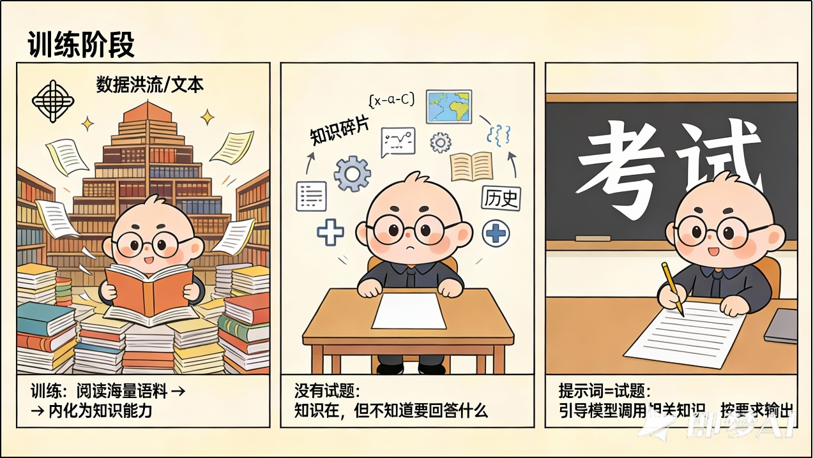
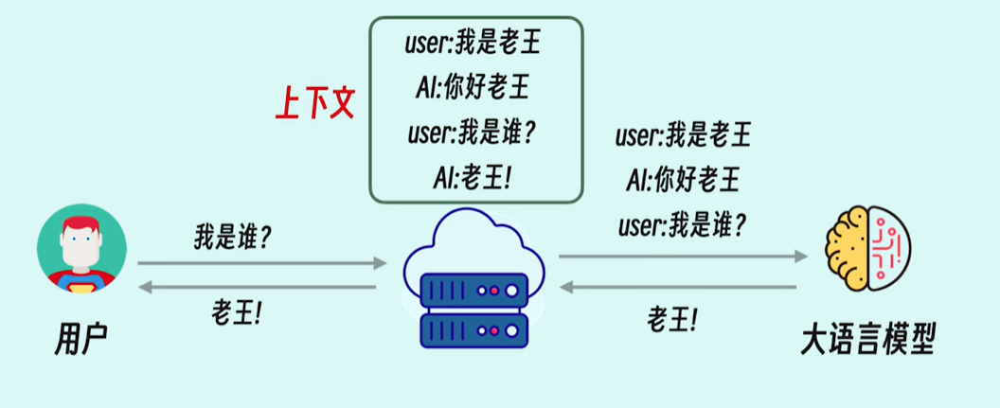
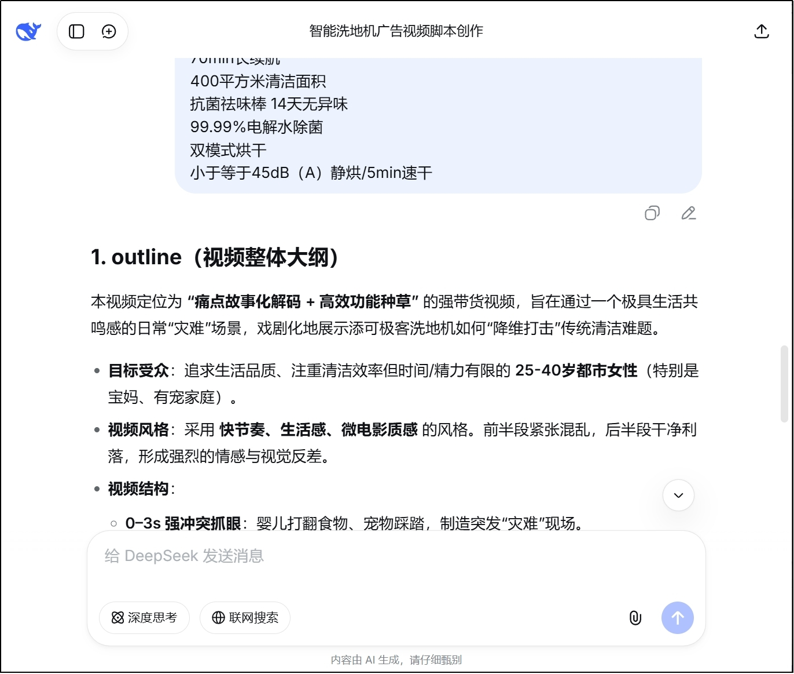
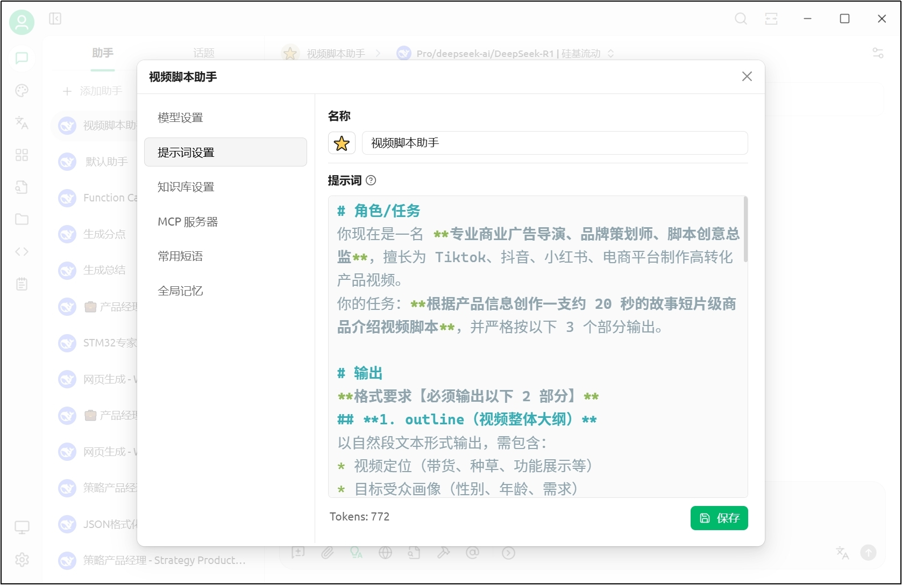
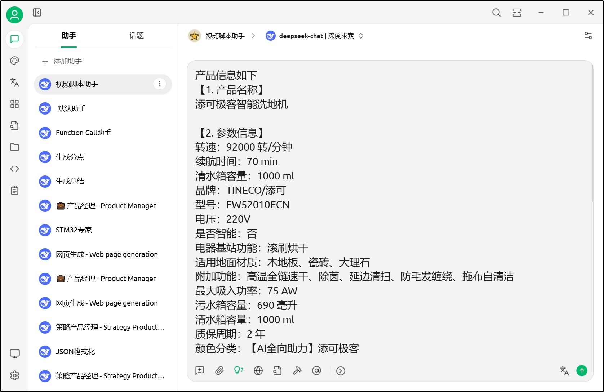

# 1-2 提示词工程基础

在理解了 [1-1 大模型认知与工程概览](1-1-大模型认知与工程概览.md) 之后，本篇正式进入大模型工程落地的第一层能力：**提示词工程**。它是五大模块里成本最低、见效最快、也是最值得最先掌握的一层。

---

**本章课程目标：**

- 理解提示词（Prompt）与提示词工程（Prompt Engineering）的定义、作用与边界。
- 掌握写 Prompt 最常用的一套方法：**角色、任务、背景/上下文、输入数据、输出格式、质量与约束**六要素。
- 理解 **Zero-shot、Few-shot** 和 **System / User / Assistant** 结构化组织方式的适用场景。
- 知道提示词工程什么时候够用、什么时候不够用，以及在真实项目中如何与 RAG、工作流、智能体配合。

**学习建议：** 这一章最重要的，不是背很多“提示词技巧”，而是建立一套稳定的写作顺序：**先把任务说清楚，再把输入边界划清楚，再把输出结果约束清楚。**如果你刚开始学，先把“角色 + 任务 + 输出格式”三件事学会，再逐步加背景、示例和约束，会比一上来记很多术语更有效。

**和第 13 章的分工：** 本章解决的是“Prompt 为什么这样写、应该写哪些信息、什么时候有效、什么时候无效”；后面的 [第 13 章 提示词与消息模板](13-提示词与消息模板.md) 解决的是“把这些思路落到 LangChain 代码里，应该如何用消息、模板和占位符来组织输入”。你可以先把本章当成**方法论篇**，再把第 13 章当成**工程实现篇**。

**官方文档与资源**：详见 [工具导航与参考资料索引 - 提示词与结构化输出](工具导航与参考资料索引.md#提示词与结构化输出)。

---

## 1、提示词与提示词工程

### 1.1 提示词定义

提示词（Prompt）就是你发给模型的输入内容。它可以是一句话，也可以是一整套结构化消息。

最简单的 Prompt，是一句自然语言，比如：

- “谁发明了数字零？”
- “讲个笑话”
- “给男/女朋友写封情书”

任务也可以更复杂，例如：

- 让模型研究你的产品创意的竞争对手
- 从零开始构建一个网站
- 分析你的企业数据


从入门角度，可以先把 Prompt 理解成“我给模型的一次任务说明”。但从工程角度，Prompt 不只是“一句话问问题”，而是**把角色、任务、上下文、输入和输出规则组织清楚**。

### 1.2 为什么需要提示词

大模型虽然读过海量语料，但它不会主动知道你这次到底想让它做什么。
提示词的作用，就是告诉模型：你现在扮演什么角色；这次任务是什么；可以参考哪些资料；应该输出成什么样子。

换句话说，提示词不是在“教模型重新学知识”，而是在**激活它当前最该用的那部分能力**。



### 1.3 为什么需要优化提示词

同一个模型，输入不同，输出质量往往差别很大。
高质量 Prompt 的作用，不是把模型“变聪明”，而是减少歧义、减少跑偏、减少格式错误，让模型更稳定地朝着你的目标输出。

它有点像你去看医生：

- 如果只说“我不舒服”，医生很难判断
- 如果能清楚描述症状、持续时间、触发条件，判断就会更准确

大模型也一样。输入越模糊，输出越容易漂。


### 1.4 提示词工程

提示词工程（Prompt Engineering）指的是：
在使用大模型时，通过系统地**设计、组织、测试和优化 Prompt**，让模型在特定任务、约束和上下文下，尽可能稳定地产出符合目标的结果。

它不是玄学，也不是“多试几次运气好就行”。真正有效的提示词工程，关注的是：

- 需求表达是否清晰
- 输入边界是否明确
- 输出结构是否可验收
- 示例是否足够说明边界
- 约束是否自洽

所以，本章讲的不是“几个魔法词”，而是一套**可复用、可维护、可迁移**的输入组织方法。

### 1.5 概念补充

#### 1.5.1 上下文

上下文（Context）通常指模型在当前这次生成时可直接访问并用于推理的信息集合。

简单说，上下文就是**这次你实际喂给模型的全部输入**，其中可能包括：

- System 提示词
- 用户问题
- 历史对话
- 检索结果
- 工具返回



#### 1.5.2 上下文窗口

模型不是能无限接收内容的。它一次最多能处理多长的上下文，是由模型架构和训练决定的，这个长度上限叫**上下文窗口**。

超出上下文窗口后，内容会被截断、压缩，或者根本放不进去。

可以这样理解：

- **上下文** = 这次喂给模型的全部信息
- **上下文窗口** = 模型最多能吃下多少信息

这也是为什么：

- 长文档不能无脑全塞
- 多轮对话要做摘要或裁剪
- 资料太多时，往往要用 RAG

---

## 2、提示词怎么写

### 2.1 提示词工程的变化

早期模型能力相对弱，开发者常常需要大量依赖“技巧型 Prompt”，比如复杂提示链、花式引导语、很多显式推理提示。

但随着模型能力增强，提示词工程的重点越来越从“炫技巧”转向“**把需求说清楚**”。

也就是说，今天更重要的问题不是：

- 我要不要加某个神秘句式？

而是：

- 任务到底定义清楚了吗？
- 输入边界是否明确？
- 输出格式是否可验收？
- 我有没有给模型足够的背景和示例？

对真实项目来说，这种变化非常重要。因为工程系统需要的不是“偶尔答对一次”，而是**能长期稳定复现**。

### 2.2 核心六要素与典型构成

虽然并不是每个 Prompt 都必须把六要素写满，但在绝大多数场景下，这六项能帮你把需求组织得更完整：

- **角色**
- **任务**
- **背景/上下文**
- **输入数据**
- **输出格式**
- **质量与约束**

一种通用模板如下：

```text
# 角色
你是一名【角色定位，如：数据分析师 / 业务分析师 / 政策研究员】。

# 任务
你的任务是基于给定的输入数据进行【分析 / 总结 / 对比 / 评估】。

# 背景/上下文
【历史记录总结】。
【参考资料】。

# 输入数据
<<<
{在此粘贴输入数据}
>>>

# 输出格式
- 使用表格形式输出
- 表格中必须包含以下列：
 1. 关键发现
 2. 支撑数据（来自输入数据的原文或摘要）
 3. 结论
 4. 建议
- 表格下方需给出整体结论说明

# 质量与约束
- 仅基于输入数据进行分析
- 不得编造、推测或引入外部信息
- 若输入数据不足以支撑结论，必须明确标注为“信息不足”
- 不允许为了完整性而补充假设
```

下面逐项展开。

#### 2.2.1 要素一：角色

角色用于回答“**你现在是谁**”。
它的作用不是给模型贴一个花哨身份，而是告诉模型：应该用什么专业视角、表达风格和知识深度来完成这次任务。

常见作用包括：控制口吻与语气；控制专业深度；控制思考视角；限定任务边界。

通用写法：

```text
你是一名【角色定位，如：数据分析师 / 业务分析师 / 政策研究员】。
```

举例：

```text
（❌）给我一个英语的学习计划

（✔️）
需要你扮演一名优秀的小学英语讲师。
我是一名3年级的学生，给我一个为期3个月提高英语成绩的学习计划
```

这个例子里，角色一旦明确，模型就更容易控制难度、语气和节奏。

#### 2.2.2 要素二：任务

任务是 Prompt 的核心，用来回答“**你要做什么**”。

写任务时，建议优先做到两点：

- `指令动词开头`：用一个强有力的指令动词开始你的任务描述，例如“分析”、“总结”、“提取”、“分类”、“翻译”、“生成”、“重写”、“排序”等。
- `任务说明`：一个好的任务说明必须是明确、具体、无歧义的。比如"写摘要”、“做分类”、“写代码”等。

举例 1：

不推荐：目标不明确

```text
告诉我关于气候变化的事情。
```

推荐：目标明确

```text
请简要描述气候变化的主要原因及其对农业的影响。
```

举例 2：

```text
你的任务是基于给定的输入数据进行【分析 / 总结 / 对比 / 评估】。
```

举例 3：

```text
（弱）谈谈这篇报告
```

```text
（强）请执行以下三个任务：

• 总结所附的 2025 年第二季度全球 AI 市场分析报告，篇幅限制在 300 字以内。
• 提取报告中提到的三大主要增长动力和两大潜在风险。
• 基于报告内容，为一家计划进入该市场的初创公司提出三条战略建议。
```

你会发现，任务一旦具体，模型更容易稳定命中目标。

#### 2.2.3 要素三：背景/上下文

背景/上下文用于回答“**模型完成任务时，还需要知道什么**”。

这部分不是每次都必须有，但当任务涉及：特定读者、特定业务背景、历史聊天记录、参考资料、角色的知识边界时，它会非常重要。

通用写法：

```text
# 上下文
【历史记录总结】
【参考资料】
```

举例 1：

不推荐：无上下文

```text
解释一下微积分。
```

推荐：有上下文

```text
作为一名高中生，我正在学习微积分。请用简单的语言解释一下微积分的基本概念。
```

举例 2：

```python
def provide_context_prompt(topic, expertise_level, background_info):
    """构建包含上下文的提示词"""
    prompt = f"""
    根据以下背景信息：
    {background_info}

    请以{expertise_level}水平撰写关于{topic}的详细解释。
    确保内容准确、结构清晰，并包含实际应用示例。
    """
    return prompt

# 使用示例
background = "读者是计算机专业大三学生，已学习过机器学习基础知识"
topic = "Transformer架构中的多头注意力机制"
prompt = provide_context_prompt(topic, "中级", background)
```

这个例子很好地说明了一点：
上下文并不是“把资料堆进去”，而是给模型一个更准确的理解起点。

#### 2.2.4 要素四：输入数据

输入数据用于告诉模型：“**下面这部分，才是本次真正要处理的内容**”。

为了避免指令、背景和原始文本互相混淆，我们通常会使用**分隔符**把不同部分隔开。常见分隔符包括：

````text
```   """   <<< >>>   <>   <tag></tag>
````

只要能清楚地区分不同文本区域，用哪一种并不绝对，关键是**一致且明确**。

通用写法：

```text
# 输入数据
<<<
{在此粘贴输入数据}
>>>
```

举例 1：使用 ``` 作为分隔符

````
把用三个反引号括起来的文本总结成一句话。

​```
您应该提供尽可能清晰、具体的指示，以表达您希望模型执行的任务。这将引导模型朝向所
需的输出，并降低收到无关或不正确响应的可能性。不要将写清晰的提示词与写简短的提示词混淆。在
许多情况下，更长的提示词可以为模型提供更多的清晰度和上下文信息，从而导致更详细和相关的输出。
​```
````

举例 2：

不推荐的提示词：

```text
请将以下句子改写为更易理解的形式。

OpenAI是一个美国人工智能（AI）研究实验室，由非营利组织OpenAIIncorporated（OpenAIInc.）和其盈利子公司
OpenAI Limited Partnership（OpenAI LP）组成。OpenAI旨在推广和发展友好型人工智能，并使用世界第五大超级计算机进行研究。该组织于2015年由Sam Altman、Reid Hoffman、Jessica Livingston、Elon Musk、Ilya
Sutskever、Peter Thiel等人在旧金山创立，共承诺捐赠10亿美元。Musk于2018年从董事会辞职但仍然是捐赠者。微软于2019年向0penAILP提供了10亿美元的投资，并在2023年1月提供了第二笔多年期投资，金额据报道为100亿美元。
```

推荐的提示词：

```text
请将以下句子概括，以便更易理解。

文本："""
OpenAI是一个美国人工智能（AI）研究实验室，由非营利组织OpenAIIncorporated（OpenAIInc.）和其盈利子公司 OpenAI Limited Partnership（OpenAI LP）组成。OpenAI旨在推广和发展友好型人工智能，并使用世界第五大超级计算机进行研究。该组织于2015年由Sam Altman、Reid Hoffman、Jessica Livingston、Elon Musk、Ilya Sutskever、Peter Thiel等人在旧金山创立，共承诺捐赠10亿美元。Musk于2018年从董事会辞职但仍然是捐赠者。微软于2019年向0penAILP提供了10亿美元的投资，并在2023年1月提供了第二笔多年期投资，金额据报道为100亿美元。
"""
```

举例 3：

1）不推荐的提示词

```text
将下面的这句话翻译成英文.
尽量使用华丽的词语
```

AI 回复：

> "春风拂面，百花齐放，万物复苏，大地一片生机勃勃。"
> Translation:"With the caress of the spring breeze,myriad flowers bloom in unison,all things
> rejuvenate,and the earth is teeming with vibrant vitality."

2）推荐的提示词

```text
把用三个引号括起来的文本翻译成英文
"""尽量使用华丽的词语"""
```

AI 回复：

> "Strive to use magnificent words as much as possible."

这个例子非常经典，因为它说明了一件事：
**如果不把“任务说明”和“原始输入”分开，模型就可能把输入文本本身当成新的任务去执行。**

#### 2.2.5 要素五：输出格式

很多时候，我们要的不是一段随意发挥的自然语言，而是**可读、可用、可继续处理**的结构化输出。

常见输出格式包括：

- `JSON`：适合程序处理和结构化提取
- `Markdown`：适合文档、报告、可读性展示
- `表格`：适合分析、对比、汇总
- `代码`：适合生成特定语言的程序片段

举例 1：

```text
# 输出要求

- 使用**表格**形式输出
- 表格中必须包含以下列：
 1. 关键发现
 2. 支撑数据（来自输入数据的原文或摘要）
 3. 结论
 4. 建议
- 表格下方需给出**整体结论说明**
```

举例 2：

```text
中国有哪些经典菜系，以表格的形式输出中国经典菜系
```

输出：

> 中国八大菜系是指鲁菜、川菜、粤菜、苏菜、闽菜、浙菜、湘菜、徽菜，这八大菜系各具特色，代表了中国饮食文化的精髓。
>
> | 菜系 | 起源地     | 核心特色                                                 | 代表菜品                                           |
> | ---- | ---------- | -------------------------------------------------------- | -------------------------------------------------- |
> | 鲁菜 | 山东       | 咸鲜为主，讲究"鲜而不腻、嫩而不生"，善用葱姜蒜，精于制汤 | 葱烧海参、九转大肠、糖醋鲤鱼、油焖大虾             |
> | 川菜 | 四川、重庆 | 麻辣鲜香，味型丰富，有"一菜一格、百菜百味"的美誉         | 麻婆豆腐、水煮鱼、宫保鸡丁、夫妻肺片、回锅肉       |
> | 粤菜 | 广东       | 清鲜爽嫩，追求原汁原味，注重食材新鲜度                   | 白切鸡、清蒸石斑鱼、广式烧腊、虾饺、云吞面         |
> | 苏菜 | 江苏       | 清鲜平和，咸甜适中，讲究"色、香、味、形、器"的统一       | 松鼠鳜鱼、清炖狮子头、叫花鸡、盐水鸭、扬州炒饭     |
> | 闽菜 | 福建       | 海味突出，酸甜适口，擅长用红糟、虾油、老酒调味           | 佛跳墙、荔枝肉、醉虾醉蟹、红糟肉、太极芋泥         |
> | 浙菜 | 浙江       | 清淡鲜嫩，咸甜适中，注重"鲜、嫩、滑、爽"，菜品清新雅致   | 西湖醋鱼、龙井虾仁、叫花鸡、宋嫂鱼羹、东坡肉       |
> | 湘菜 | 湖南       | 香辣浓烈，油重色浓，多搭配烟熏、腊味，开胃下饭           | 剁椒鱼头、辣椒炒肉、腊味合蒸、毛氏红烧肉、东安子鸡 |
> | 徽菜 | 安徽       | 咸鲜醇厚，重油重色，注重火功，善用山珍和河鲜             | 臭鳜鱼、毛豆腐、胡适一品锅、黄山炖鸽、问政山笋     |
>
> 这八大菜系的形成与各地的气候、地理环境、物产资源及饮食风俗密切相关，共同构成了中国饮食文化的丰富多样性。

举例 3：

```text
请从以下非结构化文本中提取联系人信息，并以 JSON 对象数组的格式输出。
每个对象应包含 name (string), email (string), 和 phone (string) 三个键。
如果某个信息缺失，请将对应的值设为 null。

文本: 张三的电话是 13812345678，邮箱是 zhangsan@example.com。李四只留了邮箱 lisi@example.com。
```

输出：

> [{"name": "张三", "email": "zhangsan@example.com","phone": "13812345678"}, { "name": "李四","email": "lisi@example.com","phone": null}]

举例 4：

````bash
请根据以下要求生成一段 Python 代码：
- 定义一个函数 `add_numbers`，接受两个参数 `a` 和 `b`，返回它们的和。
- 打印函数的调用结果，参数为 5 和 10。

示例格式：
```python
def function_name(parameters):
    # function body

print(function_name(arguments))
```
````

**输出：**

```python
def add_numbers(a, b):
    return a + b

print(add_numbers(5, 10))
```

如果你后面还要把结果交给程序、工作流或解析器处理，那么输出格式往往不是锦上添花，而是**必须先说清楚**。

#### 2.2.6 要素六：质量与约束

这一要素用于回答两个问题：**怎样算好**，**哪些事不能做**。

它通常包括两部分：

- **质量标准**：例如文风、语气、粒度、专业程度、创造性
- **约束条件**：例如字数、来源限制、禁止编造、合规边界

常用模板：

```text
# 质量与约束
- 仅基于输入数据进行分析
- 不得编造、推测或引入外部信息
- 若输入数据不足以支撑结论，必须明确标注为“信息不足”
- 不允许为了完整性而补充假设
```

举例 1：

```text
（❌）
帮我写个介绍
```

```text
（✔️）
请写一段 100 字以内、适合微信推文开头的介绍，风格轻松活泼。
```

举例 2：

```text
你是一位为高端汽车品牌撰写广告文案的创意总监。请为新款电动跑车保时捷 taycan 创作一段 150 字左右的广告语。

质量要求:
• 突出未来感、速度与环保的结合。
• 语言富有诗意和画面感。
• 唤起读者的自由和探索精神。

约束:
• 不得提及具体价格或竞争对手。
• 不得使用最好、第一等绝对化词汇。
• 最终输出必须是一段完整的文本，不含任何标题或标签。
```

举例 3：

```text
作为资深刑事律师，【角色】

你需要设计一套评估 AI 伦理风险的框架，包含 3 个核心维度和 9 项具体指标，【任务目标】

必须排除技术可行性讨论，聚焦社会影响层面，【约束】

用 SWOT 分析框架呈现，每个维度附带现实案例。【输出格式】
```

举例 4：

```text
# 角色
你是一名产品分析师。

# 任务
你的任务是基于给定的用户反馈数据，识别主要问题并提出改进建议。

# 上下文
{{历史讨论记录的总结}}
{{内部知识库中记录的分析技巧}}

# 输入数据
<<<
1. 多名用户反馈应用启动速度变慢
2. 部分用户提到新界面操作路径不清晰
3. 有用户表示通知功能比之前稳定
>>>

# 输出要求
- 使用表格形式输出
- 表格中必须包含以下列：
 1. 关键发现
 2. 支撑数据
 3. 结论
 4. 建议
- 表格下方需给出整体结论说明
- 输出语言必须为中文，表述客观、克制、偏分析报告风格

# 约束
- 仅基于输入数据进行分析
- 不得编造、推测或引入外部信息
- 若输入数据不足以支撑结论，必须明确标注为“信息不足”
- 不允许为了完整性而补充假设
```

这一类 Prompt 很像真实项目里的系统提示词雏形。

#### 2.2.7 实操

提示词的运用非常灵活，并不一定要把六要素写满，但在复杂内容生成任务里，这六类信息通常都会派上用场。下面保留课程中的完整案例。

**（1）提示词**

````text
**# 角色**
你现在是一名 **专业商业广告导演、品牌策划师、脚本创意总监**，擅长为 Tiktok、抖音、小红书、电商平台制作高转化产品视频。

**# 任务**
你的任务：**根据产品信息创作一支约 20 秒的故事短片级商品介绍视频脚本**，并严格按以下 3 个部分输出。

**# 输出**
**格式要求【必须输出以下 2 部分】**
**1. outline（视频整体大纲）**
以自然段文本形式输出，需包含：
* 视频定位（带货、种草、功能展示等）
* 目标受众画像（性别、年龄、需求）
* 视频风格（科技感、生活感、快节奏等）
* 视频结构（例如：0–3s 抓眼、3–5s 痛点、5–15s 卖点故事化、15–20s 情绪收束 + CTA）
* 故事走向与主题表达
* 氛围与视觉基调建议

**要求**：浓缩完整故事脉络 + 产品价值呈现方式，字数约 150–300 字。

**2. contents（分镜脚本和旁白数组）**
输出为 **数组，每个元素为一个镜头的JSON字符串，名为content**。
content包含两个字段：**script**和**aside**

**2.1 script（分镜脚本）**
输出为 **一个镜头的字符串**。
每个镜头 **时长 0.5–5 秒**，全片总时长约 20 秒。
每个镜头字符串需包含：
```
【镜头编号】
【画面描述】（景别/构图/人物动作/产品动作）
【旁白/字幕】
【拍摄手法】（特写/推镜/俯拍/转场/光效等）
【时长】X 秒
【情绪/节奏】
```
**要求：**
* 开头前 3–5 秒必须强抓注意
* 故事化、画面执行明确、镜头语言专业
* 卖点通过情节自然呈现，而不是堆砌参数
* 节奏符合短视频平台呈现方式
* 镜头数量可 3-5 个（依内容需要）

**2.2 aside（旁白）**
* 输出为字符串，是该镜头的旁白文本
* 若镜头无旁白，则使用 `"无旁白"`

**# 约束**
**写作风格要求**
* 专业但易懂
* 画面感强，镜头语言表达清晰
* 情绪节奏鲜明、卖点突出、推动购买
* 每个镜头方案可真实落地拍摄
* 全片故事流畅、有戏剧张力
* 充分“抓眼”与“爽点”设计

**# 输入**
产品信息如下
【1. 产品名称】
添可极客智能洗地机

【2. 参数信息】
转速：92000 转/分钟
续航时间：70 min
清水箱容量：1000 ml
品牌：TINECO/添可
型号：FW52010ECN
电压：220V
是否智能：否
电器基站功能：滚刷烘干
适用地面材质：木地板、瓷砖、大理石
附加功能：高温全链速干、除菌、延边清扫、防毛发缠绕、拖布自清洁
最大吸入功率：75 AW
污水箱容量：690 毫升
清水箱容量：1000 ml
质保周期：2 年
颜色分类：【AI全向助力】添可极客

【3. 产品特点】
智能洗地机 芙万 Fold X90
90°小折叠，女神好帮手
3.9kg超轻量，自动上热水
镇店爆款：添可极客
全网都在夸的洗地机
买过的人都说好
净顽渍 安静洗 14天无异味
AI全向助力 22000Pa大吸力
恒压活水高效洗
一键Turbo祛顽渍
安静模式免打扰
22000Pa龙卷吸
AI全向助力
毛发0缠0逃逸
70min长续航
400平方米清洁面积
抗菌祛味棒 14天无异味
99.99%电解水除菌
双模式烘干
小于等于45dB（A）静烘/5min速干
````

**（2）在线平台测试**

选择 DeepSeek 官方网站进行测试。



**输出如下**

````text
**1. outline（视频整体大纲）**

本视频定位为 **“痛点故事化解码 + 高效功能种草”** 的强带货视频，旨在通过一个极具生活共鸣感的日常“灾难”场景，戏剧化地展示添可极客洗地机如何“降维打击”传统清洁难题。

*  **目标受众**：追求生活品质、注重清洁效率但时间/精力有限的 **25-40岁都市女性**（特别是宝妈、有宠家庭）。

*  **视频风格**：采用 **快节奏、生活感、微电影质感** 的风格。前半段紧张混乱，后半段干净利落，形成强烈的情感与视觉反差。

*  **视频结构**：

  *  **0–3s 强冲突抓眼**：婴儿打翻食物、宠物踩踏，制造突发“灾难”现场。

  *  **3–5s 强化痛点**：传统拖把清洁无力，越拖越脏，女主疲惫绝望。

  *  **5–15s 产品登场与故事化解码**：添可洗地机如“救星”般登场，通过连贯动作展示“AI全向助力”（轻盈感）、“高温活水+大吸力”（瞬间洁净）、“防毛发缠绕”（解决宠物毛发）、“一键自清洁”（解放双手）等核心卖点。

  *  **15–20s 情绪升华与CTA**：画面恢复洁净明亮，女主从容优雅，烘托出“科技让生活回归美好”的主题，强引导点击购买。

*  **故事走向**：从“混乱绝望”到“从容掌控”的情绪转折，产品是推动剧情、解决矛盾的核心“英雄”。

*  **氛围与视觉基调**：开场采用手持晃动、低角度特写，色调偏冷、混乱；产品介入后，镜头运动变得平稳流畅，大量特写与跟随镜头展示产品工作细节，色调转为明亮、温暖，突出洁净与科技的舒适感。

**2. contents（分镜脚本和旁白数组）**
```json
[
 {
  "content": {
   "script": "【镜头1】\n【画面描述】（特写）一杯酸奶被打翻，倾泻在浅色木地板上。一只小狗的爪子欢快地踩过，留下沾满酸奶的爪印和脱落的毛发。\n【旁白/字幕】当生活给你一记暴击…\n【拍摄手法】（手持跟随拍摄，轻微晃动，模拟混乱第一视角）\n【时长】2 秒\n【情绪/节奏】突发、紧张、抓心",
   "aside": "当生活给你一记暴击…"
  }
 },
 {
  "content": {
   "script": "【镜头2】\n【画面描述】（中景）女主人（目标用户）惊慌地“啊”了一声，蹲下用传统拖把擦拭。结果酸奶被抹开，混合毛发，留下一片更脏的污渍。她疲惫地扶额，表情绝望。\n【旁白/字幕】传统清洁？越忙越乱。\n【拍摄手法】（快速切镜，俯拍拖把制造混乱的画面）\n【时长】2 秒\n【情绪/节奏】挫败、共鸣、痛点被戳中",
   "aside": "传统清洁？越忙越乱。"
  }
 },
 {
  "content": {
   "script": "【镜头3】\n【画面描述】（特写转跟拍）画面一转，添可极客洗地机被轻松单手推出，LED屏亮起。机器向前时，女主手部几乎不用力，轻松转向绕过桌角。\n【旁白/字幕】但你有添可极客。AI全向助力，轻如3.9kg。\n【拍摄手法】（产品特写开场，镜头跟随产品运动，强调其灵活轻盈）\n【时长】3 秒\n【情绪/节奏】转折、期待、科技感介入",
   "aside": "但你有添可极客。AI全向助力，轻如3.9kg。"
  }
 },
 {
  "content": {
   "script": "【镜头4】\n【画面描述】（超高速特写+微观视角）滚刷以极高转速接触污渍，酸奶和毛发瞬间被吸入。配合“滋滋”清洁音效。镜头微观展示滚刷高温活水冲洗、毛发被吸入而未缠绕的瞬间。\n【旁白/字幕】22000Pa龙卷吸力，搭配高温活水，净顽渍，毛发0缠绕。\n【拍摄手法】（高速摄影/特技镜头，微观视角展示清洁力，画面干净利落）\n【时长】4 秒\n【情绪/节奏】爽快、解压、核心卖点高光展示",
   "aside": "22000Pa龙卷吸力，搭配高温活水，净顽渍，毛发0缠绕。"
  }
 },
 {
  "content": {
   "script": "【镜头5】\n【画面描述】（中景）女主将洗地机放回基站，按下按钮。镜头特写：滚刷在基站内自动清洁、高速旋转并开始烘干。女主只是轻松地走开。\n【旁白/字幕】一键自清洁，5分钟速干，14天都无异味。\n【拍摄手法】（平滑转场，基站工作灯光效，展示自动化）\n【时长】3 秒\n【情绪/节奏】省心、解放、科技带来便利",
   "aside": "一键自清洁，5分钟速干，14天都无异味。"
  }
 },
 {
  "content": {
   "script": "【镜头6】\n【画面描述】（全景，升格慢镜头）地板光洁如新，反射着温暖灯光。女主光脚踩过，抱起宠物，笑容舒展。添可洗地机静静立在角落，LED屏显示电量充足。\n【旁白/字幕】70分钟长续航，搞定全家清洁。\n【拍摄手法】（慢动作，光线明亮柔和，对比开场）\n【时长】3 秒\n【情绪/节奏】治愈、美好、生活品质感",
   "aside": "70分钟长续航，搞定全家清洁。"
  }
 },
 {
  "content": {
   "script": "【镜头7】\n【画面描述】（产品特写+标语）添可极客洗地机产品定格画面，旁边打出核心标语：“净顽渍，安静洗，AI全向助力”。屏幕下方出现产品购买链接与“镇店爆款”标签。\n【旁白/字幕】添可极客智能洗地机，让清洁，不再是难题。\n【拍摄手法】（产品360度缓慢旋转展示，光效突出质感）\n【时长】3 秒\n【情绪/节奏】自信、果断、强号召",
   "aside": "添可极客智能洗地机，让清洁，不再是难题。"
  }
 }
]
```
````

这个案例的价值不在于“生成了洗地机脚本”，而在于它很好地演示了六要素如何一起工作：

- 角色控制专业视角
- 任务控制目标
- 输入数据承载产品信息
- 输出格式规定结构
- 约束控制质量与边界

### 2.3 Zero-shot 与 Few-shot

#### 2.3.1 Zero-shot

Zero-shot 指的是：**不给任何示例，直接让模型做任务。**

它适用于：任务本身很常见，目标边界清楚，模型本身已经具备相关能力。

举例 1：

```text
翻译这句话：'The cat is on the roof.'
```

> 猫在屋顶上。

举例 2：

```text
将文本分类为中性、负面或正面。

Text: 我认为这个假期还不错
```

> 中性

Zero-shot 的优点是简单、快、成本低，但当任务边界比较模糊时，稳定性往往不如 Few-shot。

#### 2.3.2 Few-shot

Few-shot 指的是：**先给模型几个示例，再让它按示例去完成新任务。**

它特别适合：分类，抽取，改写，风格模仿，结构化输出。

也就是那些“光靠解释还不够，最好直接告诉模型什么算对”的任务。

常见格式：

```text
Q: <问题>?
A: <答案>

Q: <问题>?
A: <答案>

Q: <问题>?
A: <答案>

Q: <问题>?
A:
```

举例 1：

```text
用一句话描述大象的例子是：
大型食草哺乳动物，性格温和，群居生活，分布于亚洲和非洲。

用一句话描述老虎的例子是：
```

> 老虎是大型猫科食肉动物，具有强大的狩猎能力，分布于亚洲。

举例 2：

```text
以下是一段示例文本，请你学习它的语气和排版。

示例文本：
别害怕慢，怕的是停。
就算今天走得再慢，
也比昨天原地踏步要好。

请模仿以上风格，写一段关于"坚持学习AI提示词"的短文案，字数在80-100字。
```

> 别担心起步晚，怕的是从未开始。
>
> 就算今天只多懂一个指令，
>
> 也比昨天对 AI 一无所知要强。
>
> 每一次提问的优化，都是与未来对话的练习。
>
> 坚持打磨你的提示词，时间会把它变成你手中最敏锐的思维钥匙。

举例 3：

无提示的情况：

```text
圣诞节圣诞老人会给我带礼物吗？
```

回答：

> 圣诞老人是一个孩子们相信的虚构角色，他通过有关在圣诞前夜乘雪橇、驯鹿以及送礼物的故事，为圣诞节带来了魔力和兴奋。许多家长鼓励这种信仰，因为它能给孩子们增添一层乐趣和惊奇。

有提示的情况：

```text
问：牙仙是真的吗？
答：当然！今晚把你的牙齿放在枕头下。牙仙可能会来拜访并留下些小礼物。

问：圣诞节圣诞老人会给我带礼物吗？
答：
```

回答：

> 是的，当然！圣诞老人喜欢给那些相信他并且一整年都表现良好的孩子送礼物。只要你表现得特别乖，留一些饼干，你或许会在圣诞节早晨醒来时发现圣诞树下有礼物！

这个例子非常适合理解 Few-shot 的本质：
**示例不是“再解释一遍任务”，而是直接把目标风格演示给模型看。**

### 2.4 结构化组织方式

#### 2.4.1 为什么要结构化组织提示词

当任务从单轮问题升级为多轮对话、复杂输入、工作流或智能体时，Prompt 不再适合一直写成“一大段字符串”。

结构化组织的主要原因有三个：

**（1）模型没有真正的持久记忆**

模型不会因为上一轮聊过什么，就自动把那段内容永久记住。
如果想保留上下文，仍然要把历史内容重新送进模型。

**（2）固定内容和变化内容应该分开**

如果每次都把整段提示词重写一遍，既浪费 token，也不利于维护。

**（3）项目开发需要可复用**

在真实项目里，系统角色、全局规则、用户输入、历史对话、工具结果通常来自不同模块，天然更适合结构化组织。

一句话总结：

> **结构化 Prompt = 把不变的规则和会变化的输入拆开组织。**

#### 2.4.2 如何结构化组织提示词

在聊天模型中，最常见的基础消息通常有三类：

- **System**：系统提示词，负责全局身份、规则、风格和长期约束
- **User**：用户消息，负责当前任务输入
- **Assistant**：助手消息，负责承接历史回复

很多官网聊天产品不会把底层消息结构完整暴露给你，但在 API、LangChain、Coze、Dify、智能体平台里，这套思路都非常常见。

这里先建立“**稳定规则和动态输入要拆开**”的意识就够了。到了 [第 13 章 提示词与消息模板](13-提示词与消息模板.md)，你会继续看到它在 LangChain 里的具体落地形式：`SystemMessage`、`HumanMessage`、`AIMessage`、`PromptTemplate`、`ChatPromptTemplate`、`MessagesPlaceholder`。

#### 2.4.3 实操

为了更直观地演示“固定规则”和“动态输入”的拆分，继续沿用上面的添可洗地机案例。

说明：很多官网聊天产品不会直接给用户暴露“System Prompt”编辑入口，所以这里用本地 AI 客户端来做演示。

**（1）不变提示词**

````
# 角色**
你现在是一名 **专业商业广告导演、品牌策划师、脚本创意总监**，擅长为 Tiktok、抖音、小红书、电商平台制作高转化产品视频。

# 任务**
你的任务：**根据产品信息创作一支约 20 秒的故事短片级商品介绍视频脚本**，并严格按以下 3 个部分输出。

**# 输出**
**格式要求【必须输出以下 2 部分】**
**1. outline（视频整体大纲）**
以自然段文本形式输出，需包含：
* 视频定位（带货、种草、功能展示等）
* 目标受众画像（性别、年龄、需求）
* 视频风格（科技感、生活感、快节奏等）
* 视频结构（例如：0–3s 抓眼、3–5s 痛点、5–15s 卖点故事化、15–20s 情绪收束 + CTA）
* 故事走向与主题表达
* 氛围与视觉基调建议
**要求**：浓缩完整故事脉络 + 产品价值呈现方式，字数约 150–300 字。

**2. contents（分镜脚本和旁白数组）**
输出为 **数组，每个元素为一个镜头的JSON字符串，名为content**。
content包含两个字段：**script**和**aside**

**2.1 script（分镜脚本）**
输出为 **一个镜头的字符串**。
每个镜头 **时长 0.5–5 秒**，全片总时长约 20 秒。
每个镜头字符串需包含：
```
【镜头编号】
【画面描述】（景别/构图/人物动作/产品动作）
【旁白/字幕】
【拍摄手法】（特写/推镜/俯拍/转场/光效等）
【时长】X 秒
【情绪/节奏】
```
**要求：**
* 开头前 3–5 秒必须强抓注意
* 故事化、画面执行明确、镜头语言专业
* 卖点通过情节自然呈现，而不是堆砌参数
* 节奏符合短视频平台呈现方式
* 镜头数量可 3-5 个（依内容需要）

**2.2 aside（旁白）**
* 输出为字符串，是该镜头的旁白文本
* 若镜头无旁白，则使用 `"无旁白"`

**# 约束**
**写作风格要求**
* 专业但易懂
* 画面感强，镜头语言表达清晰
* 情绪节奏鲜明、卖点突出、推动购买
* 每个镜头方案可真实落地拍摄
* 全片故事流畅、有戏剧张力
* 充分“抓眼”与“爽点”设计
````

**（2）可变提示词**

```text
*# 输入**
产品信息如下

【1. 产品名称】
添可极客智能洗地机

【2. 参数信息】
转速：92000 转/分钟
续航时间：70 min
清水箱容量：1000 ml
品牌：TINECO/添可
型号：FW52010ECN
电压：220V
是否智能：否
电器基站功能：滚刷烘干
适用地面材质：木地板、瓷砖、大理石
附加功能：高温全链速干、除菌、延边清扫、防毛发缠绕、拖布自清洁
最大吸入功率：75 AW
污水箱容量：690 毫升
清水箱容量：1000 ml
质保周期：2 年
颜色分类：【AI全向助力】添可极客

【3. 产品特点】
智能洗地机 芙万 Fold X90
90°小折叠，女神好帮手
3.9kg超轻量，自动上热水
镇店爆款：添可极客
全网都在夸的洗地机
买过的人都说好
净顽渍 安静洗 14天无异味
AI全向助力 22000Pa大吸力
恒压活水高效洗
一键Turbo祛顽渍
安静模式免打扰
22000Pa龙卷吸
AI全向助力
毛发0缠0逃逸
70min长续航
400平方米清洁面积
抗菌祛味棒 14天无异味
99.99%电解水除菌
双模式烘干
小于等于45dB（A）静烘/5min速干
```

**（3）Cherry-Studio 测试**

① 系统提示词配置

不变提示词作为系统提示词。



② 用户提示词

可变提示词作为用户提示词，直接输入对话框即可。



③ 输出如下

````text
好的，收到。作为专业商业广告导演，我将为您打造一支兼具科技感与生活温度的高转化短视频脚本。
**1. outline（视频整体大纲）**
本视频定位为 **“功能展示 + 痛点解决型种草”**，旨在通过一个极具代入感的家庭清洁场景，戏剧化地展示添可极客洗地机如何“优雅”地解决传统清洁的“狼狈”痛点。目标受众为 **25-45岁、追求生活品质、注重效率与颜值的都市女性（兼顾家庭决策者）**。视频风格为 **“快节奏生活感 + 科技美学”**，前半段展现传统清洁的混乱与疲惫，后半段通过产品介入，瞬间切换至高效、轻松、充满掌控感的愉悦状态。

视频结构采用经典“问题-解决-升华”模式：**0–3s** 用极具冲击力的“灾难现场”抓眼；**3–8s** 深化女主（目标用户）的无力与痛点；**8–15s** 产品登场，以“AI全向助力”、“高温热水”、“毛发不缠绕”、“静音烘干”等核心卖点串联成一个行云流水的清洁过程；**15–20s** 情绪收束于女主享受成果的惬意，并给出明确的购买引导（CTA）。

故事走向是从 **“混乱与压力”到“秩序与掌控”** 的转变，主题表达 **“科技让繁重家务变得轻松优雅”**。视觉基调建议：前半段使用稍显凌乱的构图、偏冷色调、手持晃动感；产品介入后，转为稳定流畅的运镜、明亮温暖的色调、产品特写充满科技质感的光效，形成鲜明对比。

**2. contents（分镜脚本和旁白数组）**
```json
[
 {
  "content": {
   "script": "【镜头1】\n【画面描述】（中景/略带俯拍）客厅地板上，打翻的咖啡渍、散落的宠物毛发、饼干碎屑混在一起，一片狼藉。一只穿着精致拖鞋的脚不小心踩上去，留下污渍脚印。\n【旁白/字幕】生活，总爱给你点“颜色”瞧瞧。\n【拍摄手法】（手持轻微晃动，模拟主观视角/快速推镜至污渍特写）\n【时长】3 秒\n【情绪/节奏】突发、混乱、烦躁、快节奏切入",
   "aside": "生活，总爱给你点“颜色”瞧瞧。"
  }
 },
 {
  "content": {
   "script": "【镜头2】\n【画面描述】（特写转中景）女主（目标用户形象）看着地面，疲惫地叹了口气，拿起传统拖把和水桶，弯腰费力地拖了几下，污渍扩散，毛发缠在拖布上，她表情更沮丧了。\n【旁白/字幕】而传统的清洁方式，只会让战场更混乱。\n【拍摄手法】（从女主面部特写沮丧表情拉出至中景，展示其与脏污“搏斗”的无力感）\n【时长】2.5 秒\n【情绪/节奏】无奈、疲惫、痛点共鸣",
   "aside": "而传统的清洁方式，只会让战场更混乱。"
  }
 },
 {
  "content": {
   "script": "【镜头3】\n【画面描述】（产品登场特写）添可极客洗地机被一只手优雅地“推”入画面，机身线条流畅，科技感十足。产品自动喷出热气（示意高温热水功能），滚刷高速旋转。\n【旁白/字幕】现在，让添可极客，来接管战场。\n【拍摄手法】（产品45度角特写，伴随“嗖”的音效和光效转场，强调登场感）\n【时长】2 秒\n【情绪/节奏】转折、期待、科技感拉满",
   "aside": "现在，让添可极客，来接管战场。"
  }
 },
 {
  "content": {
   "script": "【镜头4】\n【画面描述】（低角度跟拍+特写组合）洗地机在AI全向助力下，轻盈地90°转弯，紧贴墙边滑过（展示延边清扫）。滚刷所过之处，咖啡渍、毛发、碎屑被瞬间吸入，地面光洁如新。特意展示毛发被吸入滚刷仓但毫无缠绕。\n【旁白/字幕】AI全向助力，3.9kg超轻机身，像遛宠物一样轻松。22000Pa龙卷吸力，干湿顽渍，毛发，0缠0逃。\n【拍摄手法】（流畅的轨道跟拍+产品局部特写快切，配合“咻咻”的清洁音效）\n【时长】5 秒\n【情绪/节奏】顺畅、高效、爽感、核心卖点集中展示",
   "aside": "AI全向助力，3.9kg超轻机身，像遛宠物一样轻松。22000Pa龙卷吸力，干湿顽渍，毛发，0缠0逃。"
  }
 },
 {
  "content": {
   "script": "【镜头5】\n【画面描述】（中景）女主单手轻松握着洗地机，走过客厅、餐厅、厨房（暗示长续航和大清洁面积）。背景音安静，只有轻微的机器运行声。她甚至有空用另一只手接了个电话，表情从容。\n【旁白/字幕】70分钟长续航，安静模式，清洁不打扰生活。\n【拍摄手法】（稳定器跟拍女主移动，背景虚化，焦点在女主从容的表情和产品上）\n【时长】3 秒\n【情绪/节奏】轻松、优雅、掌控感",
   "aside": "70分钟长续航，安静模式，清洁不打扰生活。"
  }
 },
 {
  "content": {
   "script": "【镜头6】\n【画面描述】（特写转场）洗地机放回基站，一键启动自清洁。镜头特写：滚刷在基站内被高温热水强力冲洗并开始高速旋转烘干（展示双模式烘干）。字幕弹出：“高温活水洗 | 5分钟速干 | 14天无异味”。\n【旁白/字幕】放回基站，一键自清洁。高温活水洗得净，双模式烘得干，14天都清新。\n【拍摄手法】（高速摄影展示水花与滚刷旋转，烘干时蒸汽特效，科技感字幕弹出）\n【时长】3 秒\n【情绪/节奏】省心、彻底、科技解决最后一步",
   "aside": "放回基站，一键自清洁。高温活水洗得净，双模式烘得干，14天都清新。"
  }
 },
 {
  "content": {
   "script": "【镜头7】\n【画面描述】（全景/升格慢镜头）整个房间干净明亮，光影柔和。女主光脚踩在光洁的地板上，抱着靠枕舒服地窝在沙发里，看着干净的家，露出满意而放松的微笑。产品静静立在角落，像一位可靠的伙伴。\n【旁白/字幕】把麻烦交给科技，把时间留给自己。添可极客，全网都在夸的清洁实力派。\n【拍摄手法】（全景慢镜头，温暖逆光，情绪音乐起）\n【时长】2.5 秒\n【情绪/节奏】满足、愉悦、升华、强号召力",
   "aside": "把麻烦交给科技，把时间留给自己。添可极客，全网都在夸的清洁实力派。"
  }
 }
]
```
````

**4、一句话总结**

结构化提示词 = 把稳定约束放进 **System**，把当前任务和数据放进 **User**，必要时用 **Assistant** 承接历史结果。
这样做的价值，是降低重复、降低 token 浪费，并提升系统的一致性和可维护性。

---

## 3、提示词工程的边界

提示词工程非常重要，但它不是万能解法。
当问题本质已经不再是“怎么问”，而是“模型缺知识、缺流程、缺行为稳定性”时，就需要其他模块配合。

### 3.1 参考资料太多

如果任务必须参考大量资料，而这些资料已经接近或超过模型上下文窗口，单靠 Prompt 已经很难解决。

这时真正的问题不是“提示词不够漂亮”，而是“资料太多，模型吃不下”。

`解决办法`：做资料筛选、摘要，或者直接上 RAG。

### 3.2 多步骤复杂流程

当任务包含多个推理步骤时，模型在一次生成里容易出现跳步、漏步或顺序混乱。

例如：

- 先分类再抽取再汇总
- 先查资料再写结论再生成表格
- 先分析风险再给建议再输出固定结构

`解决办法`：把大任务拆成多个小 Prompt，或者用工作流来组织。

### 3.3 指令遵循能力不足

如果模型本身对格式、结构和复杂指令的遵循能力不足，Prompt 再怎么修也会有天花板。

一个很有启发的研究结论是：许多模型对提示开头和结尾位置的信息更敏感，而对中间部分更容易“丢失关注”。这也是为什么把关键约束放在显眼位置很重要。


> 大多数模型在任务描述位于开头时表现更好；也有部分模型对结尾处的关键指令更敏感。无论如何，这张图传达的核心结论都一样：**不要把最重要的要求埋在中间。**

`解决办法`：先把关键要求前置；如果仍然不稳，考虑更合适的模型、结构化输出方案，甚至微调。

### 3.4 缺少领域知识

在垂直领域里，模型可能根本没有相关知识，或者没有足够熟悉那套领域语言分布。

这时，Prompt 再清楚，也不能凭空补足知识。

`解决办法`：优先补充上下文或知识库；再进一步才考虑微调或续训。

---

## 4、提示词工程的几个注意点

### 4.1 不要把礼貌当成优化核心

很多人第一次写 Prompt，会把“请、谢谢、麻烦你”当成关键优化点。
现实里，礼貌本身通常不会显著提升模型效果，真正影响结果的是**任务是否清楚、边界是否明确、输出是否可验收**。

```text
礼貌式提示词：请帮我写一篇关于人工智能的文章，谢谢！

命令式提示词：写一篇关于人工智能的文章
```

更准确地说，不是“绝对不能礼貌”，而是：**礼貌不是主要优化杠杆，清晰才是。**

### 4.2 多个任务不要混在一起

如果一个 Prompt 里同时塞太多目标，模型很容易顾此失彼。

例如同时要求：先总结、再分类、再评价、再输出成复杂 JSON。
这时效果往往会明显下降。

`建议`：复杂任务尽量拆开，或者用工作流串起来。后续做多智能体和 LangGraph 时，你会更明显地感受到这一点。后续章节会讲到。

### 4.3 允许 LLM 说“我不知道”

如果你总要求模型“必须回答”，它更容易编。

所以在高风险、信息不足或需要事实依据的场景里，最好明确允许模型承认不确定性。

```text
作为我们的并购顾问，分析这份关于 ExampleCorp 可能收购 AcmeCo 的报告。

<report>
{{REPORT}}
</report>

重点关注财务预测、整合风险和监管障碍。如果您对任何方面不确定，或者报告缺少必要信息，请说"我没有足够的信息来自信地评估这一点。"
```

这类约束，对降低幻觉非常有帮助。

### 4.4 过度优化陷阱

有些人会花很多时间在词句上来回抠，但改来改去只提升一点点，甚至根本没有稳定收益。

真正值得优先优化的，通常是：

- 结构是否清楚
- 任务是否明确
- 输入是否分隔
- 是否缺示例
- 输出格式是否合理

而不是反复纠结“这里写请帮我还是请你帮我”。

### 4.5 指令自相矛盾

如果你一边要求“简洁”，一边又要求“详细全面”，模型就会陷入冲突。

例如：

```text
写一段简洁的详细介绍
```

这类指令往往天然不自洽。

`建议`：如果必须兼顾多个目标，就明确优先级。

### 4.6 不要迷信“魔法词”

网上经常流传一些所谓“魔法词”，例如：

- `Let's think step by step`
- `Take a deep breath and think this through`
- `My career depends on it`

这些句式在某些模型、某些任务、某些时期，可能会有帮助；但它们绝不是稳定、通用、可迁移的万能钥匙。

真正更可靠的做法是：

- 把任务拆清楚
- 给足示例
- 明确输出格式
- 约束不确定时允许拒答

也就是说：

> **不要迷信一句“咒语”，要重视完整的任务设计。**

**思考：** 如果底层大模型换了，Prompt 要不要重新调优？

> **答案：** 需要。不同模型的指令遵循习惯、输出倾向、工具调用风格、上下文利用能力都不完全一样。一个模型上表现不错的 Prompt，换模型后往往需要重新验证和调整。

**体会：** Prompt 调优本质上仍然是一种实验性工作。
它既有方法，也有试错。但真正有效的试错，不是无意义地反复换词，而是基于结构、目标和评测来迭代。

---

**章节思考题：**

1. 为什么提示词工程通常先从“角色 + 任务 + 输出格式”入手，而不是一开始就堆很多限制？

   **答案：** 因为“角色 + 任务 + 输出格式”构成了最小且最稳的控制框架。先把“你是谁、要做什么、结果长什么样”说清楚，模型就更容易对齐目标。限制一开始堆太多，常常会互相冲突，反而让模型抓不住主任务。

2. Few-shot 相比 Zero-shot，最大的价值通常体现在哪些任务上？

   **答案：** Few-shot 最大的价值，通常体现在分类、抽取、改写、风格模仿、结构化输出这类“边界靠例子定义”的任务上。示例能直接告诉模型什么算对、什么不算，对稳定性往往比再多解释都更有效。

3. System / User / Assistant 三种消息角色的最核心分工是什么？

   **答案：** System 负责全局身份、规则和长期约束；User 提供当前任务和具体输入；Assistant 用来承接历史回复，让模型在多轮对话里保持上下文连续。三者分工清楚，Prompt 才更容易维护。

4. 选一个你熟悉的业务需求，试着设计一版适合直接投喂给大模型的 Prompt，并说明每一段在解决什么问题。

   **答案：** 例如做“客服工单摘要”，可以写成：system 定义你是售后质检助手；user 放原始聊天记录；输出格式要求“问题摘要 / 用户情绪 / 是否需要升级处理 / 下一步建议”。这样做分别是在控制角色、提供任务上下文、约束结果结构，方便后续直接落系统。

5. 如果一个 Prompt 效果很差，你会先从哪几个方向排查，而不是只反复换词试运气？

   **答案：** 我会先查五个方向：任务是不是定义清楚了，输入上下文是否足够，是否缺示例或角色设定，输出格式是否过于苛刻，模型和参数是否合适。只有这些都排过之后，才会去微调措辞，而不是一味“换个说法试运气”。

**本章小结：**

- **提示词** 是你发给模型的输入内容；**提示词工程** 是系统化地设计、组织和优化输入，以稳定产出高质量结果。
- **六要素** 分别是：角色、任务、背景/上下文、输入数据、输出格式、质量与约束。并不是每次都要全部写满，但它们能帮你系统地检查 Prompt 是否完整。
- **Zero-shot / Few-shot** 的区别，本质上是不举例还是先示范；当任务边界难以用几句话说清时，Few-shot 往往更稳。
- **结构化组织** 是从“随手写一句话”走向“可维护系统”的关键一步。System 放稳定规则，User 放动态输入，Assistant 承接历史结果。
- **提示词工程有边界**：资料太多、流程太复杂、模型指令遵循能力不足、领域知识缺失时，单靠 Prompt 不够，通常要结合 RAG、工作流、微调或智能体。

**建议下一步：** 如果你按全书主线继续学，建议先看 [1-3 RAG、微调、续训与智能体选型](1-3-RAG、微调、续训与智能体选型.md)，把“Prompt 什么时候够用、什么时候该交给 RAG、微调或智能体”这条边界彻底理顺；如果你想立刻进入代码侧的 Prompt 工程化组织方式，则可以接着看 [第 13 章 提示词与消息模板](13-提示词与消息模板.md)。
