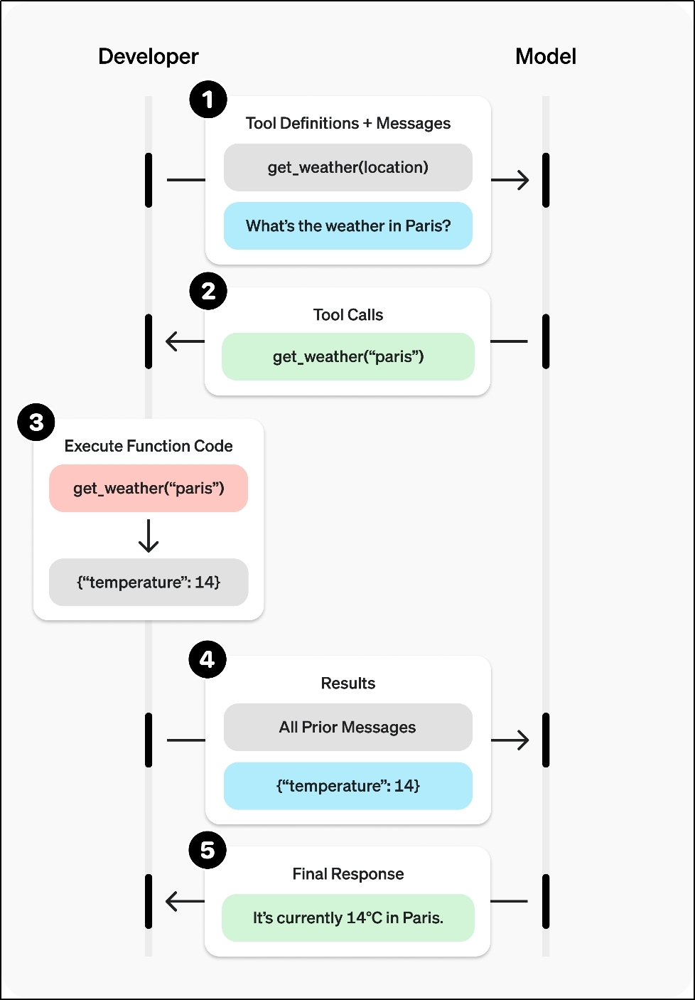
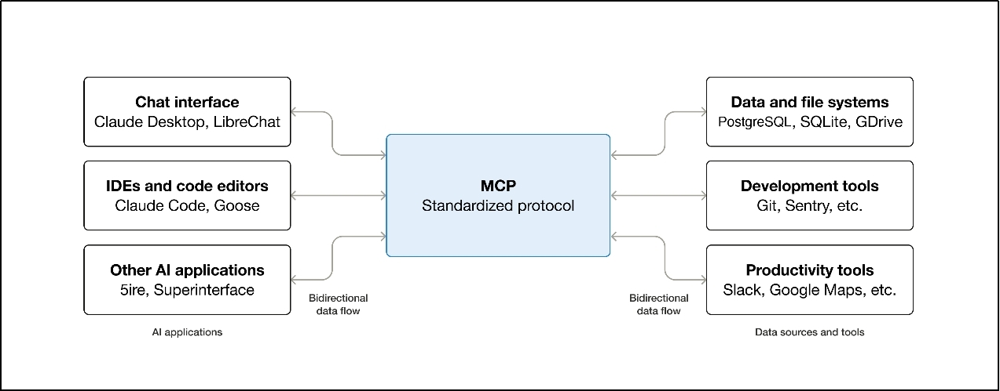

# 1-3 RAG、微调、续训与智能体选型

当单靠提示词工程无法满足需求时，就要开始考虑更进一步的工程手段。本篇围绕五大模块中的后四项展开：**RAG、微调、续训、智能体开发**。它们看起来都像“让模型更强”，但本质上解决的是不同类型的问题。

---

**本章课程目标：**

- 建立一张清晰的选型地图：知道 **RAG、微调、续训、智能体** 分别在解决什么问题。
- 理解 RAG 的核心价值是**补知识**，理解微调的核心价值是**改行为**，理解续训的核心价值是**补领域分布**。
- 理解智能体并不是“更强的大模型”，而是**大模型 + 工具 + 状态 + 执行流程**的系统。
- 能结合真实项目判断：什么时候继续优化 Prompt，什么时候上 RAG，什么时候考虑微调，什么时候再引入工作流（Workflow）或 Agent。

**学习建议：** 学这章时，建议始终围绕三条线来判断方案：**知识够不够、行为稳不稳、流程会不会动。**
如果缺的是知识，先看 RAG；如果缺的是输出风格、格式、指令遵循，先看微调；如果缺的是更底层的领域语言能力，才考虑续训；如果缺的是多步决策、外部工具调用和执行能力，再看智能体。这样你就不会把几种方案混成一团。

---

## 1、RAG

### 1.1 什么是 RAG

**1）定义**

RAG（Retrieval-Augmented Generation，检索增强生成）是一种把**信息检索**与**大模型生成**结合起来的应用架构。

它的核心思想很简单：

1. 用户先提问。
2. 系统先去外部知识库里找相关资料。
3. 再把“问题 + 检索结果”一起发给大模型。
4. 由模型基于这些资料生成答案。

所以，RAG 的重点不是“修改模型参数”，而是**在运行时给模型补充它当前真正需要的上下文**。

一句话理解就是：**RAG = 先查资料，再回答问题。**

这和 [1-2 提示词工程基础](1-2-提示词工程基础.md) 的区别也很重要：

- **提示词工程**主要依赖你提前写好的 Prompt。
- **RAG**主要依赖系统在提问时实时检索到的外部资料。


**官方文档与资源：**

- **LangChain RAG 官方教程**：https://docs.langchain.com/oss/python/langchain/rag
- **OpenAI Model Optimization 指南**：https://developers.openai.com/api/docs/guides/model-optimization
- **DeepSeek Function Calling 官方文档**：https://api-docs.deepseek.com/guides/function_calling/
- **Anthropic Tool Use 官方文档**：https://docs.anthropic.com/en/docs/agents-and-tools/tool-use/implement-tool-use
- **MCP 官方介绍**：https://modelcontextprotocol.io/introduction
- **LangChain Agents 官方文档**：https://docs.langchain.com/oss/python/langchain/agents
- **RAG 原始论文**：https://arxiv.org/abs/2005.11401
- **LoRA 论文**：https://arxiv.org/abs/2106.09685
- **QLoRA 论文**：https://arxiv.org/abs/2305.14314

### 1.2 为什么 RAG 往往是项目里的第一选择

从工程角度看，RAG 之所以常常先于微调和续训，不是因为它“最先进”，而是因为它**最符合大多数业务问题的真实成因**。

真实项目里，大模型答不好，常见原因通常有三类：

- **知识过时**：例如最新政策、最新产品说明、最新公告。
- **知识私有**：例如企业制度、内部接口文档、项目手册、客户资料。
- **证据不足**：模型有通用知识，但没有你当前要它参考的那份资料，因此容易幻觉。

这三类问题，本质上都更像“模型没看到材料”，而不是“模型不会说话”。这时你最先应该做的，往往不是训练模型，而是**把资料喂对**。RAG 正是解决这个问题的。

它的现实优势主要有：

- **更新快**：知识库更新后可以重新建索引，不必重新训练模型。
- **成本低**：相比微调和续训，实施门槛和试错成本通常更低。
- **可追溯**：检索结果可以保留来源、页码、文件名，方便核验。
- **更贴近业务系统**：文档、数据库、FAQ、接口说明等都可以成为外部知识源。

在本仓库里，RAG 不是一个孤立概念，而是后续很多章节的主线能力：

- [2-RAG-搭建企业私有&个人知识库](2-RAG-搭建企业私有&个人知识库.md) 会从平台角度带你搭建知识库。
- [19-RAG检索增强生成](19-RAG检索增强生成.md) 会从 LangChain 代码角度带你拆开 RAG 的技术链路。
- `掌柜问数` 项目里，系统也不是“直接把问题交给模型”，而是先通过 **MySQL + Qdrant + Elasticsearch** 组成的元数据知识库做多路召回，再生成 SQL。这其实就是一种面向结构化问数场景的 RAG 思路。

### 1.3 RAG 的工作流程

虽然 RAG 常被一句话概括成“先检索，再生成”，但在工程上，它通常分成两个阶段：

**阶段一：知识库构建（离线）**

- 读取原始文档
- 做清洗和切分
- 用嵌入模型把文本块转成向量
- 把文本块、向量和元数据写入向量数据库

**阶段二：检索与生成（在线）**

- 用户发起问题
- 将问题向量化
- 从知识库中召回相关片段
- 把片段与问题一起组装进 Prompt
- 交给大模型生成最终回答

可以把它理解成：

- **索引阶段**解决“资料怎么准备好”
- **问答阶段**解决“资料怎么在提问时被找出来并用上”

这也是为什么真正的 RAG 从来不只是“向量库 + 大模型”这么简单。文档质量、分块策略、召回方式、重排策略、Prompt 组织方式，都会影响最终效果。

### 1.4 何时需要 RAG

当你遇到下面这些场景时，优先考虑 RAG 通常是最合理的：

- 需要接入**企业内部资料**、产品文档、FAQ、制度手册、接口说明等私有知识
- 需要回答**最新信息**、时效性很强的问题
- 希望回答结果能附带**依据和来源**
- 希望在不改模型参数的情况下，快速迭代知识内容

典型场景包括：

- 企业知识库问答
- 智能客服与售后助手
- 研发文档问答
- 运维排障助手
- 合同、制度、政策、课程讲义等文档问答

### 1.5 实现方式

RAG 的实现方式大致可以分为三类：

**（1）在线平台**

例如 Cherry Studio、ima、Dify、FastGPT、RAGFlow 等。优点是上手快、可视化、验证快，适合初学者或快速搭原型。

**（2）离线客户端**

例如本地知识库客户端、桌面 AI 工具，适合个人知识管理和轻量实验。

**（3）借助框架或纯代码实现**

例如基于 LangChain、LangGraph 或纯 Python 自己搭建完整的文档加载、切分、向量化、检索和生成流程。这种方式灵活度最高，也最接近真实项目开发。

### 1.6 RAG 的几个常见误区

**误区 1：有知识库就一定不会幻觉**

不是。RAG 只能显著降低幻觉，不能保证 100% 正确。检索错了、召回噪声太多、Prompt 没约束好，模型仍然可能答错。

**误区 2：文档全塞进去就行**

不是。RAG 的关键不是“文档数量多”，而是“**能不能把真正相关的那几段稳稳找出来**”。

**误区 3：RAG = 向量检索**

也不完全对。向量检索只是常用手段，真实项目里经常会结合关键词检索、过滤、重排、元数据约束一起使用。

**误区 4：RAG 能替代一切训练**

不能。RAG 解决的是“模型没看到知识”的问题，不擅长解决“模型不会按固定风格/格式输出”的问题。

---

## 2、微调（Fine-tuning）

### 2.1 什么是微调

微调（Fine-tuning）是指在已经训练好的基础模型上，继续用特定数据做训练，使模型在某类任务、某种风格或某种输出形式上表现更稳定。

在工程语境里，你可以把它先记成一句话：**微调主要是在改模型的“行为方式”，而不是在给模型外挂一套知识库。**

它最常见的目标包括：

- 让模型更稳定地遵循指令
- 让模型输出固定格式，例如 JSON、SQL、标签、分类结果
- 让模型更符合某种业务风格、品牌口吻或术语习惯
- 让模型在某类任务上更稳，例如分类、抽取、代码补全、客服回复

需要特别提醒的是，微调虽然也可能让模型“记住一些样例”，但它**并不适合承载高频变化的知识**。如果知识经常变，仍然应该优先考虑 RAG 或外部知识源。

> **初学者常问：** 微调是不是把企业资料“灌进模型里”？
> 更准确的说法是：微调更擅长让模型“按你想要的方式做事”，而不是“记住所有最新资料”。知识经常变化的场景，优先考虑 RAG；风格、格式、任务习惯长期不稳的场景，再考虑微调。

### 2.2 何时需要微调

当你遇到下面这些问题时，微调才更可能是对路的方案：

**（1）模型行为不稳定**

比如：

- 明明已经写了输出格式，还是经常不按格式来
- JSON、SQL、分类标签这类输出经常飘
- 多轮提示后仍然经常漏字段、漏步骤

**（2）风格和话术需要长期固化**

例如：

- 客服回复要长期保持统一口吻
- 某行业报告要始终遵循同一种写作规范
- 品牌文案需要稳定体现品牌语气

**（3）提示词已经很重，但效果还是不稳**

如果你已经反复优化 Prompt、增加示例、做结构化约束，效果仍然不理想，说明问题可能不只是“提示没写好”，而是模型对这类任务的行为模式还不够稳定。

### 2.3 何时可以微调

不是所有团队都适合上来就微调。一般至少要满足下面两个前提：

**（1）数据足够**

微调依赖的是**高质量、任务相关、标注明确**的数据。没有好数据，微调很容易沦为“把噪声训练进模型”。

**（2）评测标准清楚**

如果你连“什么叫变好了”都说不清，就很难知道微调到底有没有价值。真实项目里，先做清楚评测集和验收标准，往往比先开始训练更重要。

**（3）算力与预算可接受**

虽然微调远比续训便宜，但依然需要训练资源、数据清洗和评测成本。

### 2.4 微调的技术方法

随着模型越来越大，全参数微调并不是大多数团队的首选。工程上更常见的是参数高效微调。

**（1）全参数微调（Full Fine-tuning）**

更新模型全部参数，理论上上限更高，但训练资源和显存开销都很大，适合资源充足、目标明确的场景。

**（2）参数高效微调（PEFT, Parameter-Efficient Fine-Tuning）**

这类方法的核心思路是：**尽量少改参数，用更低成本获得可接受的效果。**

最常见的两种是：

- **LoRA**：冻结原模型大部分参数，只训练新增的低秩适配参数。
- **QLoRA**：在 LoRA 基础上结合低比特量化，进一步降低显存占用。

**（3）其他高效方法**

- `Adapter Tuning`：在模型层间插入小型适配器模块
- `Prefix Tuning`：在输入前添加可学习的虚拟前缀
- `P-Tuning v2`：在模型每一层添加可训练的提示向量

这些方法你在入门阶段不必死记公式，但要建立一个工程认知：
**今天大多数团队如果自己做微调，优先考虑的通常不是全参，而是 LoRA / QLoRA 这类 PEFT 路线。**

### 2.5 主要风险

微调并不是“只要训一下就更强”，它的常见风险包括：

- **过拟合**：训练集表现很好，真实场景一塌糊涂
- **灾难性遗忘**：模型学了新任务，原有能力被冲掉
- **样本偏差**：把团队自己的偏见、噪声、错误格式一起学进模型
- **评测幻觉**：只看少量样例感觉“效果不错”，但没有系统评测

所以微调前后都要问自己：
**我到底是在解决一个长期、稳定、可评测的行为问题，还是只是暂时觉得 Prompt 写得不够顺手？**

### 2.6 RAG vs 微调

RAG 和微调最容易被混淆，但它们的核心分工其实非常清楚：

- **RAG 更偏补知识**
- **微调更偏改行为**


可以先用下面这张工程对照表来建立判断：

| 维度           | RAG                        | 微调（Fine-tuning）        |
| -------------- | -------------------------- | -------------------------- |
| 核心目标       | 给模型补充外部知识         | 让模型更稳定地按目标做事   |
| 是否修改参数   | 否                         | 是                         |
| 更适合解决什么 | 私有知识、最新知识、可追溯 | 风格、格式、指令遵循、分类 |
| 更新速度       | 快，改知识库即可           | 慢，需要重新训练           |
| 成本结构       | 系统开发成本为主           | 数据、训练、评测成本为主   |
| 典型场景       | 文档问答、知识库、客服知识 | 结构化输出、统一话术       |

最常见的判断口诀是：

- **缺知识**：先看 RAG
- **缺行为**：再看微调

---

## 3、续训（Continued Training）

### 3.1 什么是续训

续训通常更准确地说是 **Continued Pretraining**，也就是在模型已经完成通用预训练后，再用某一领域的大规模原始语料继续训练，让模型更熟悉该领域的语言分布、术语体系和知识结构。

你可以把它理解成：**续训是让模型“更懂某个世界”，微调是让模型“更会按要求做事”。**

和微调相比，续训更接近预训练逻辑，通常使用的是**海量无标注文本**，而不是精心整理的“指令 - 答案”样本。

### 3.2 何时需要续训

只有在下面这类场景里，续训才比较值得考虑：

- 模型对某个领域语言分布存在明显系统性缺失
- 不是只差几个术语，而是整套领域表达都“不像这个行业的人”
- RAG 和微调都无法很好弥补这种底层缺口

例如：

- 大规模法律、医疗、金融、代码语料的领域适配
- 新语言、冷门编程语言、专业文献体系的长期能力增强
- 需要让模型在某个垂直领域具有更自然的基础表达和理解能力

### 3.3 何时可以续训

续训对资源要求比微调高得多，通常需要同时满足：

**（1）数据充足**

需要的是大量高质量原始文本，而不是少量指令样本。规模往往是 GB 到 TB 级。

**（2）硬件充足**

续训通常需要更长训练时间、更高显存、更强的数据处理能力。

**（3）业务收益足够大**

多数企业项目其实用不到续训。因为它成本高、风险高、迭代慢，很多问题用 `RAG + Prompt` 或 `RAG + 微调` 已经能解决。

### 3.4 工程实践中的常见误区

**误区 1：把 SFT 样本拿去做续训**

续训更接近语言建模，不是拿“问答对”硬灌进去。

**误区 2：把领域知识缺失问题全都交给微调**

如果模型连该领域“说话方式”都不熟，单靠微调往往不够稳。

**误区 3：企业项目动不动就想续训**

这是最常见的误区。绝大多数业务问题，没必要一上来就碰续训。

### 3.5 微调 vs 续训

很多团队之所以“做了训练但效果一般”，往往就是把本该续训的问题拿去微调，或者反过来。

**1）一句话区分**

微调：让模型“按你想要的方式做事”。具体的：行为对齐／风格对齐／任务对齐。

续训：让模型“知道它原来不知道的世界”。具体的：知识扩充／语言分布补全／能力下沉。

**2）核心对比总览**

| 维度         | 微调（Fine-tuning）      | 续训（Continued Pre-training） |
| ------------ | ------------------------ | ------------------------------ |
| 训练目标     | 改行为方式               | 改知识分布 / 语言分布          |
| 数据形式     | 指令数据、对话数据、标签 | 大规模原始文本                 |
| 是否依赖标注 | 强依赖                   | 通常不依赖                     |
| 数据规模     | 千级、万级、十万级       | 十万级、百万级、海量语料       |
| 算力成本     | 低到中                   | 高                             |
| 常见方法     | LoRA / QLoRA / PEFT      | 更接近预训练流程               |
| 典型问题     | 格式、风格、指令遵循     | 领域语言理解和分布偏差         |

**3）典型应用场景对照**

| 场景                         | 正确选择   |
| :--------------------------- | :--------- |
| 客服机器人更像「某公司风格」 | 微调       |
| 模型学会某行业黑话           | 续训       |
| 提高 SQL 生成稳定性          | 微调       |
| 让模型理解行业文档           | 续训 + RAG |
| 新语言/新编程语言            | 续训       |
| 工具调用更稳定               | 微调       |

**4）工程上的组合拳**

实际项目中，很少“二选一”，而是：

标准工业流程：通用基座模型 → 领域续训（补知识分布）→ 指令微调（对齐行为）→RLHF / RLAIF（优化偏好）

顺序通常不能反。因为如果你先微调，再做大规模续训，前面学到的行为模式可能会被冲掉。

> **可这样记：** **续训** = 让模型「知道原来不知道的世界」（补知识、补领域语言）；**微调** = 让模型「按你想要的方式做事」（对齐行为、格式、风格）。工程上多数场景用「RAG + 提示词」或「RAG + 微调」即可，续训成本高、效果不可控，除非确有领域知识系统性缺失再考虑。

---

## 4、智能体开发

### 4.1 什么是智能体？

在经典 AI 语境里，智能体（Agent）指能够感知环境、做出决策并执行动作，以实现目标的系统。

在大模型应用开发里，可以先用一句更工程化的话来理解：

> **智能体 = 大模型 + 工具 + 状态 + 执行流程**

也就是说，智能体并不只是“会聊天的模型”，而是一个能够：

- 理解用户目标
- 决定下一步做什么
- 选择是否调用工具
- 接收工具结果
- 基于结果继续决策
- 直到完成任务的系统

五大核心要素通常包括：

- 大语言模型（LLM）
- 记忆系统（Memory）
- 工具调用（Tools）
- 规划决策（Planning）
- 行动执行（Action）

OpenAI 前安全系统团队负责人`翁丽莲`于 2023 年 6 月在个人博客系统化总结了当时流行的 LLM Agent 典型架构。


**与单纯大模型的本质区别：**

- 大模型主要负责“生成回答”
- 智能体负责“围绕目标持续决策并执行动作”

例如：

- 单纯大模型会告诉你“可以查天气 API”
- 智能体会真的去调天气 API，再把结果组织成回答

### 4.2 何时需要智能体

当任务开始呈现下面这些特征时，就要认真考虑智能体：

- 任务是**多步骤**的，而不是一句话能答完
- 需要**调用外部工具**，例如天气、搜索、数据库、浏览器、发消息
- 中间结果会影响后续动作，流程不是完全固定的
- 需要一定的状态管理、规划、失败重试或反思机制

例如：

- “先查知识库，再查数据库，再生成一份报告”
- “先查库存，再查价格，再决定推荐哪一款商品”
- “先检索用户资料，再调外部系统完成操作，再返回结果”

在本仓库里，智能体这条主线后续会继续展开：[3-基于 Coze&Dify 平台的智能体开发](3-基于Coze&Dify平台的智能体开发.md)、[20-MCP模型上下文协议](20-MCP模型上下文协议.md)、[21-Agent智能体](21-Agent智能体.md)、[22-LangGraph概述与快速入门](22-LangGraph概述与快速入门.md)

`掌柜问数` 项目里，虽然主体是面向 SQL 生成的工作流（Workflow），但它本质上也体现了“检索、筛选、生成、校验、执行”的多步智能体 / 工作流思路。

> **可这样记：** Prompt 更像“把一句话问清楚”，RAG 更像“先给模型补资料”，Agent 更像“把一件事做完”。

### 4.3 工具调用的实现方式

#### 4.3.1 Function Calling

**1、定义**

Function Calling（函数调用，也常写作 Function Call、Tool Calling、工具调用）是模型和外部工具交互的一种标准能力。模型不会自己真的调用天气接口、数据库或发邮件接口，而是会根据工具描述，先输出“应该调用哪个工具、传什么参数”，然后由你的代码真正执行。

也就是说：

- **模型负责决定**
- **程序负责执行**

这就是 Function Calling 的本质。

**2、流程**




**3、演示【重要】**

以 DeepSeek 官方 API 为例演示 Function Calling。整体流程共五步：

① 告诉模型「有哪些工具、用户说了什么」；

② 模型决定「要调哪个工具、传什么参数」并返回；

③ 我们的代码真正执行工具拿到结果；

④ 把工具结果塞回对话发给模型；

⑤ 模型根据结果生成最终回复。

（1）步骤一：**定义工具 + 发用户消息**

**作用：**把「用户问了什么」和「你现在允许模型用哪些工具」一次性交给模型。模型没有内置天气接口，只有你通过 `tools` 传了 `get_weather` 的 name、description 和 parameters，它才知道可以调用这个工具。

```bash
curl https://api.deepseek.com/chat/completions \
 -H "Content-Type: application/json" \
 -H "Authorization: Bearer ${API_KEY}" \
 -d '{
 "model": "deepseek-chat",
 "messages": [
    {
     "role": "system",
     "content": "你是个智能天气查询助手，根据用户的提问自主调用工具"
    },
    {
     "role": "user",
     "content": "北京市天气如何？"
    }
  ],
   "tools": [
    {
     "type": "function",
     "function": {
      "name": "get_weather",
      "description": "根据用户输入的城市信息，获取该城市的天气",
      "parameters": {
       "type": "object",
       "properties": {
        "city": {
         "type": "string",
         "description": "城市名称，只保留最细粒度的地区名称"
        }
       },
       "required": ["city"]
      }
     }
    }
   ]
  }'
```

（2）步骤二：**模型返回“要调哪个工具、参数是什么”**

**作用：**模型根据上下文判断需要查天气，于是返回 `tool_calls`。注意这里它只是“提出调用请求”，并没有真的去执行天气接口。

```json
{
  "id": "7cccd00d-f0a5-4b2e-872c-a54bdb767796",
  "object": "chat.completion",
  "created": 1767176438,
  "model": "deepseek-chat",
  "choices": [
    {
      "index": 0,
      "message": {
        "role": "assistant",
        "content": "我来帮您查询北京市的天气情况。",
        "tool_calls": [
          {
            "index": 0,
            "id": "call_00_Kpq3g6mPl9BYlZIe1NSNm3Cs",
            "type": "function",
            "function": {
              "name": "get_weather",
              "arguments": "{\"city\": \"北京\"}"
            }
          }
        ]
      },
      "logprobs": null,
      "finish_reason": "tool_calls"
    }
  ],
  "usage": {
    "prompt_tokens": 336,
    "completion_tokens": 52,
    "total_tokens": 388,
    "prompt_tokens_details": {
      "cached_tokens": 0
    },
    "prompt_cache_hit_tokens": 0,
    "prompt_cache_miss_tokens": 336
  },
  "system_fingerprint": "fp_eaab8d114b_prod0820_fp8_kvcache"
}
```

（3）步骤三：**在本地/服务端真正执行工具**

**作用：**你的程序根据步骤二里的 `name` 和 `arguments` 去真正执行天气函数或第三方 API 请求，并得到真实结果。这里为了教学，直接给出假设返回值。

```json
{
  "temp": "2℃",
  "text": "晴",
  "wind": "西北风3级"
}
```

（4）步骤四：**把工具结果塞回对话，再请求模型**

**作用：**模型必须“看到”工具执行结果，才能生成最终面向用户的自然语言回答。

```bash
curl https://api.deepseek.com/chat/completions \
  -H "Content-Type: application/json" \
  -H "Authorization: Bearer ${API_KEY}" \
  -d '{
  "model": "deepseek-chat",
  "messages": [
        {
          "role": "system",
          "content": "你是个智能天气查询助手，根据用户的提问自主调用工具"
        },
        {
          "role": "user",
          "content": "北京市天气如何？"
        },
        {
            "role": "assistant",
            "content": "我来帮您查询北京市的天气情况。",
            "tool_calls": [
                {
                    "index": 0,
                    "id": "call_00_Kpq3g6mPl9BYlZIe1NSNm3Cs",
                    "type": "function",
                    "function": {
                        "name": "get_weather",
                        "arguments": "{\"city\": \"北京\"}"
                    }
                }
            ]
        },
        {
          "role": "tool",
          "tool_call_id": "call_00_Kpq3g6mPl9BYlZIe1NSNm3Cs",
          "content": "{\"temp\":\"2℃\",\"text\":\"晴\",\"wind\":\"西北风3级\"}"
        }
      ],
      "tools": [
        {
          "type": "function",
          "function": {
            "name": "get_weather",
            "description": "根据用户输入的城市信息，获取该城市的天气",
            "parameters": {
              "type": "object",
              "properties": {
                "city": {
                  "type": "string",
                  "description": "城市名称，只保留最细粒度的地区名称"
                }
              },
              "required": ["city"]
            }
          }
        }
      ]
    }'
```

（5）步骤五：**模型根据工具结果生成最终回复**

**作用：**这一步模型不再返回 `tool_calls`，而是直接给用户最终答案。

```json
{
  "id": "4f5f2133-6519-497e-aecc-2bd25a37c747",
  "object": "chat.completion",
  "created": 1767177264,
  "model": "deepseek-chat",
  "choices": [
    {
      "index": 0,
      "message": {
        "role": "assistant",
        "content": "根据查询结果，北京市当前的天气情况如下：\n\n- **温度**：2℃\n- **天气状况**：晴\n- **风力**：西北风3级\n\n今天北京天气晴朗，温度在2℃左右，风力不大，是个不错的天气。建议您外出时适当保暖，虽然天气晴朗但温度还是偏低的。"
      },
      "logprobs": null,
      "finish_reason": "stop"
    }
  ],
  "usage": {
    "prompt_tokens": 422,
    "completion_tokens": 70,
    "total_tokens": 492,
    "prompt_tokens_details": {
      "cached_tokens": 384
    },
    "prompt_cache_hit_tokens": 384,
    "prompt_cache_miss_tokens": 38
  },
  "system_fingerprint": "fp_eaab8d114b_prod0820_fp8_kvcache"
}
```

**4）Function Calling 的不足**

**（1）工具实现与复用成本高**

很多工具是某个项目自己定义的，和业务环境耦合较重，不容易跨团队、跨客户端复用。

**（2）规范碎片化**

不同模型厂商的工具调用格式、字段命名、细节行为并不完全一致，维护成本会逐渐上升。

**（3）可靠性依赖工具描述质量**

工具描述不清、参数 schema 不完整时，模型就更容易调错工具或传错参数。

#### 4.3.2 MCP

**1、定义**

MCP（Model Context Protocol，模型上下文协议）是一套面向 AI 应用与外部能力连接的开放协议。你可以把它理解成：

> **MCP 是把“工具、资源、提示模板”等能力按统一方式暴露出来的一层标准接口。**

MCP 更关注的是“**怎么统一接入和复用外部能力**”，而不仅仅是“模型会不会调某个函数”。

MCP 就像 AI 世界的 USB-C 接口。只要某个能力按 MCP 标准暴露出来，支持 MCP 的不同 AI 应用就可以更容易地发现和使用它。



**Function Calling 与 MCP 的关系与区别**

Function Calling 和 MCP 不是同一个东西，但经常会一起出现。

|            | **Function Calling**         | **MCP**                            |
| ---------- | ---------------------------- | ---------------------------------- |
| **是什么** | 模型调用工具的能力           | 一套标准化通讯协议                 |
| **关注点** | 模型怎么表达“我要调哪个工具” | 工具和资源怎么统一暴露、发现和复用 |
| **作用**   | 让模型能调用外部能力         | 让外部能力能被不同 AI 应用统一接入 |
| **适用层** | 更偏模型调用层               | 更偏应用接入层 / 工具生态层        |

更容易记的方式是：

- **Function Calling**：模型侧的调用能力
- **MCP**：工具侧的标准化暴露方式

**2、流程**


MCP 可以理解为对“工具接入”做了进一步标准化。除了 Tools，它还支持 Resources 和 Prompts。

最常用的是 **Tools**，但它的设计范围比传统 Function Calling 更大。

**MCP 使用理解（以 Cherry Studio + 天气为例）**

可以这样理解：

- **MCP 是协议**
- **天气 MCP Server 是实现了该协议的服务**
- **Cherry Studio 是支持该协议的客户端**
- **DeepSeek / 其他模型仍然在负责理解用户意图并决定是否调用工具**

所以当你在 Cherry Studio 里连接了天气 MCP Server，再问“北京天气怎么样”时，背后不是模型自己突然学会了天气接口，而是：

1. 客户端把可用工具列表告诉模型
2. 模型决定调用 `get_weather`
3. 客户端通过 MCP 调用对应 Server
4. Server 返回天气结果
5. 模型再把结果组织成自然语言

**大模型如何知道“什么时候调”“调哪一个”？**

- **什么时候调？**
  因为客户端会把当前所有可用工具及其描述发给模型，模型根据用户问题和工具描述，判断是否需要调用。

- **调哪一个？**
  因为每个工具都有 `name`、`description`、`parameters`，模型会根据用户问题和工具描述进行匹配。

所以模型并不是“认识 MCP”本身，而是认识“这次请求里有哪些可用工具”。

**3、常用的 MCP 网站推荐**

https://mcp.so/ ：国内开发者常用的 MCP 资源聚合站点，适合浏览和发现现成 MCP Server。

https://smithery.ai/servers ：提供 MCP Server 目录、筛选和一键生成配置的能力，适合新手快速尝试。

https://bailian.console.aliyun.com/?tab=mcp#/mcp-market ：阿里云百炼的 MCP 市场入口。

**4）相较于 Function Calling 的优势**

MCP 一定程度上弥补了 Function Calling 在生态层面的不足：

- **复用更强**：一个 MCP Server 可以被多个客户端复用
- **适配更统一**：不同 AI 应用按同一协议接能力
- **更利于形成工具生态**：工具不再只服务某个单一应用

### 4.4 智能体开发方式

当前常见的智能体开发方式主要有两类：

**（1）在线平台开发**

例如 Dify、Coze。这类方式上手快，适合做可视化编排和快速原型。

**（2）基于框架开发**

例如 LangChain、LangGraph。这类方式自由度更高，更适合真实项目开发和复杂业务逻辑落地。

### 4.5 工作流（Workflow）

**1、什么是工作流**

工作流（Workflow）可以看作一种更强调**固定步骤和可控执行**的设计模式。它通常用于把复杂任务拆成一系列明确步骤，并按预设顺序执行。


例如：先分类、再检索、再生成、再校验、再输出。

这类场景不一定需要 Agent 临场自由决策，更适合工作流。

比如：讯飞星辰 Agent 平台：https://agent.xfyun.cn/home：讯飞星辰 Agent 平台，提供工作流（Workflow）开发和部署能力。


**2、工作流（Workflow）和 Agent 怎么区分**

这是实际项目里非常重要的判断。

| 场景特征                             | 更适合什么         |
| ------------------------------------ | ------------------ |
| 步骤固定、顺序明确、强调可控和稳定   | 工作流（Workflow） |
| 步骤不固定、需要动态选工具和持续决策 | Agent              |

所以很多真实系统并不是“只做 Agent”或者“只做工作流（Workflow）”，而是：

**固定部分用工作流（Workflow），动态部分再交给 Agent。**

`掌柜问数` 就很适合拿来理解这件事。它不是放任模型完全自由发挥，而是先做召回、再做生成、再做校验和执行，整体更接近 **工作流（Workflow）主导 + 大模型参与关键节点决策** 的工程思路。

**3、工作流开发方式**

（1）Dify、Coze 等在线平台开发工作流

（2）基于 LangChain / LangGraph 等框架开发工作流

---

**章节思考题：**

1. RAG 和微调在“补知识”与“改行为”上的分工差异是什么？

   **答案：** RAG 主要解决“模型没有看到最新或私有知识”的问题，是运行时补上下文；微调主要解决“模型回答风格、格式、指令遵循不稳定”的问题，是通过训练改行为模式。简单说，RAG 更偏补知识，微调更偏改行为。

2. 为什么说续训的硬件成本通常远高于微调？

   **答案：** 因为续训通常要在更大规模原始语料上继续训练模型，训练时间更长、显存和算力要求更高，还涉及更重的数据清洗和训练稳定性问题；微调一般只在更小、更聚焦的数据集上做行为适配，成本通常低很多。

3. MCP、Function Calling、工作流（Workflow）在“接能力”和“控流程”上分别更偏哪一层？

   **答案：** MCP 更偏统一接入层，解决“外部能力怎么标准化暴露和复用”；Function Calling 更偏模型调用层，解决“模型怎么表达要调哪个工具”；工作流（Workflow）更偏流程编排层，解决“步骤怎么固定、顺序怎么控制”。

4. 现在请你回过头，用这章的框架重新解释“五大模块到底怎么选”，并说明什么时候该用工作流（Workflow），什么时候才该上 Agent。

   **答案：** 先判断缺的是什么。缺知识，优先 Prompt + RAG；缺行为稳定性，再看微调；缺底层领域分布，才考虑续训。流程固定、强调稳定和解释性时优先工作流（Workflow）；只有当任务需要动态决策、连续选工具和根据中间结果调整路线时，才更适合上 Agent。

5. 如果你要给团队新人做一次技术路线分享，你会如何用“知识、行为、流程”三条线来组织这些方案？

   **答案：** 我会把它讲成三条线：知识线看要不要补外部资料，优先 RAG；行为线看模型是否需要长期稳定输出某种格式或风格，优先微调；流程线再分固定流程和动态决策，固定流程用工作流（Workflow），动态决策和工具编排才考虑 Agent。这样最容易做最小够用的选型。

**本章小结：**

- **RAG** 解决的是“模型没看到知识”的问题，尤其适合私有知识、最新知识、可追溯问答。它不改模型参数，而是在运行时补上下文。
- **微调** 解决的是“模型行为不稳定”的问题，更适合风格、格式、指令遵循、结构化输出等长期一致性要求高的场景。
- **续训** 解决的是“模型底层领域分布不熟”的问题，成本高、门槛高，不应成为大多数项目的第一选择。
- **智能体** 解决的是“怎么围绕目标做多步决策并调用外部能力”的问题；Function Calling 偏模型调用能力，MCP 偏统一接入协议，工作流（Workflow）偏固定流程编排。
- 从选型顺序看，比较稳的思路通常是：**先 Prompt，再看 RAG，再看微调，续训放到更后面；流程固定先工作流（Workflow），流程开放再上 Agent。**

**建议下一步：** 建议按你最关心的能力线继续往下走：想把 RAG 真正落地，就看 [第 19 章 RAG 检索增强生成](19-RAG检索增强生成.md)；想理解工具接入和协议层，就看 [第 20 章 MCP 模型上下文协议](20-MCP模型上下文协议.md)；想理解多步决策与执行，就看 [第 21 章 Agent 智能体](21-Agent智能体.md)。
