# 4 - Python 调用 Dify 平台工作流

本章偏**平台调用实战**：学会用 API 和 Python 调用你在 Dify 上已搭建好的工作流，把“页面里的工作流”真正变成“代码里可调用的服务”。

---

**本章课程目标：**

- 知道调用前需在 Dify 中**发布工作流**，并会**创建 API 密钥**（密钥与工作流一一对应）。
- 掌握 Dify 工作流调用最核心的 5 个要素：**URL、Authorization、`inputs`、`response_mode`、`user`**。
- 能用 **Postman** 或 **Python + requests** 成功触发一个 Dify 工作流，并从流式结果里拿到最终输出。
- 会在 Dify 工作空间里查看运行日志，把“代码侧日志”和“平台侧日志”对起来排查问题。

**学习建议：** 第一次学习时，不要把注意力放在“背接口字段”上，更重要的是建立一条稳定心智模型：**平台中发布工作流 -> 用 API Key 鉴权 -> 传 `inputs` -> 解析运行事件 -> 去后台日志对照排查**。如果你已经看过 [第 3 章](3-基于Coze&Dify平台的智能体开发.md) 的平台案例，本章会是非常自然的下一步。

---

## 1、调用前必须完成的三件事

### 1.1 先发布工作流

要通过 API 的方式启动工作流，**工作流必须处于已发布状态**。

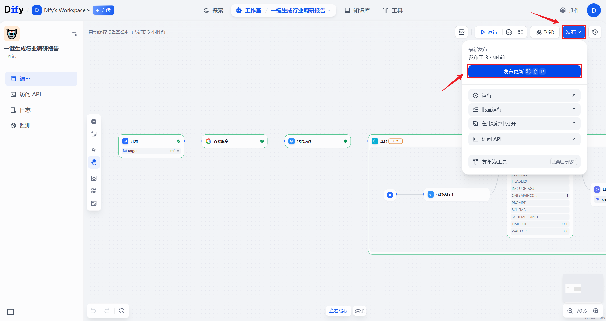

这一步很好理解：未发布的工作流仍处于编辑态，节点、变量、提示词都可能随时变化，不适合作为外部代码依赖的服务接口。

### 1.2 查看 API 文档

Dify 会为工作流提供对应的 API 文档入口。

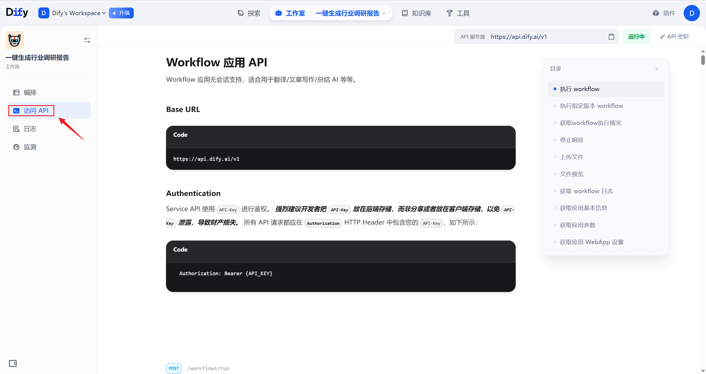

第一次学习时，建议你不要跳过这一步。因为后面 Python 代码里用到的 URL、请求头、请求体结构，平台都已经给你说明了。

### 1.3 创建 API 密钥

#### 1.3.1 创建密钥

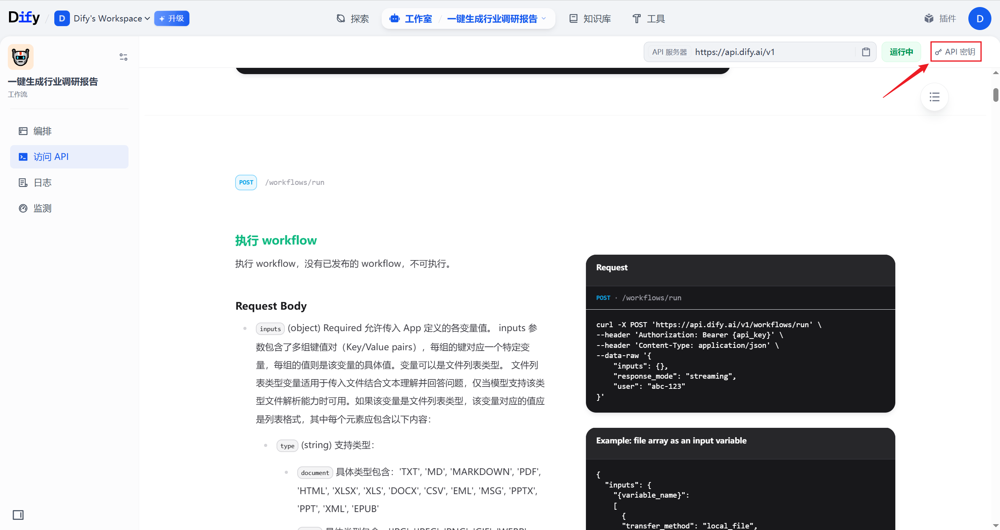

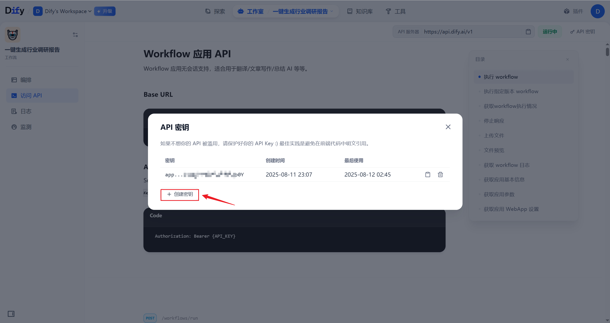

创建后复制即可。

#### 1.3.2 工作流和 API Key 的关系

Dify 的 API 密钥是**和工作流绑定**的。一个 API Key 只能用于**访问特定的工作流**，而一个工作流可以对应多个 API Key。

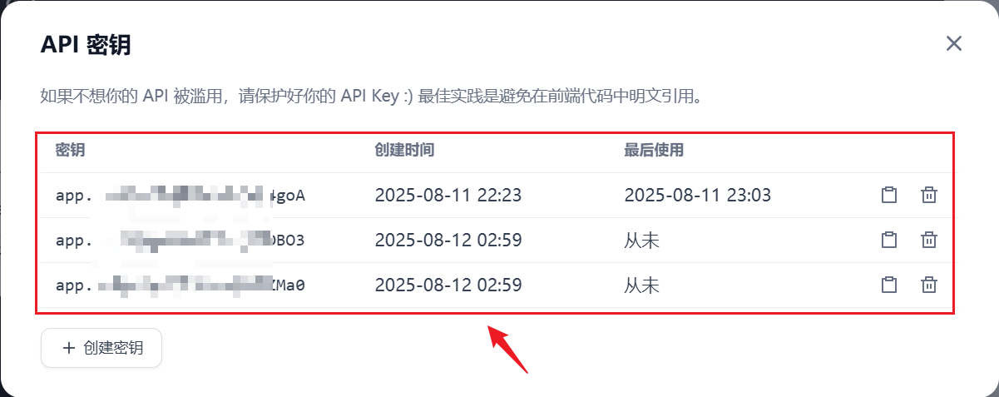

这和真实项目的权限控制很像：同一个工作流可以给不同环境、不同服务、不同调用方分发不同密钥，但密钥本身并不是“整个工作空间通用”的万能钥匙。

## 2、先看懂请求结构

通过 POST 请求启动工作流，官方常见写法如下：

```sh
curl -X POST 'https://api.dify.ai/v1/workflows/run' \
--header 'Authorization: Bearer {api_key}' \
--header 'Content-Type: application/json' \
--data-raw '{
  "inputs": {},
  "response_mode": "streaming",
  "user": "abc-123"
}'
```

### 2.1 URL

```text
https://api.dify.ai/v1/workflows/run
```

如果你使用的是本地部署版 Dify，通常改成：

```text
http://localhost/v1/workflows/run
```

如果是服务器部署，则替换成你自己的域名或服务器地址。

### 2.2 请求头

| 键            | 值                 |
| ------------- | ------------------ |
| Authorization | `Bearer {api_key}` |
| Content-Type  | `application/json` |

其中 `api_key` 替换为上一步创建的密钥。

### 2.3 请求体

```json
{
  "inputs": {},
  "response_mode": "streaming",
  "user": "abc-123"
}
```

这三个字段分别解决不同问题：

- `inputs`：传给工作流的业务入参，字段名必须和工作流中定义的输入变量对齐。
- `response_mode`：决定返回方式，是流式还是阻塞式。
- `user`：标识调用方，便于平台日志区分不同用户或请求来源。

### 2.4 streaming 和 blocking 的区别

- **流式（streaming）**：基于 SSE（Server-Sent Events）边执行边返回，适合长时间任务、需要看到过程日志的场景。
- **阻塞式（blocking）**：等待工作流全部执行完再一次性返回，写法更简单，但长流程更容易超时。

> **可这样记：** 调试和真实项目里，一般优先用 `streaming`。因为它既能让你拿到最终结果，也能帮助你看到中间节点发生了什么。

## 3、先用 Postman 验证一次

这一节不是必须的，但非常推荐。因为很多问题在 Python 接入之前，先用 Postman 就能定位清楚。

### 3.1 新建 POST 请求并填写 URL

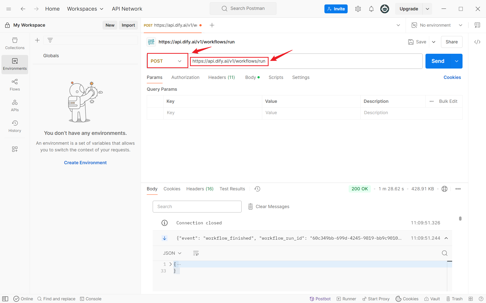

### 3.2 添加请求头

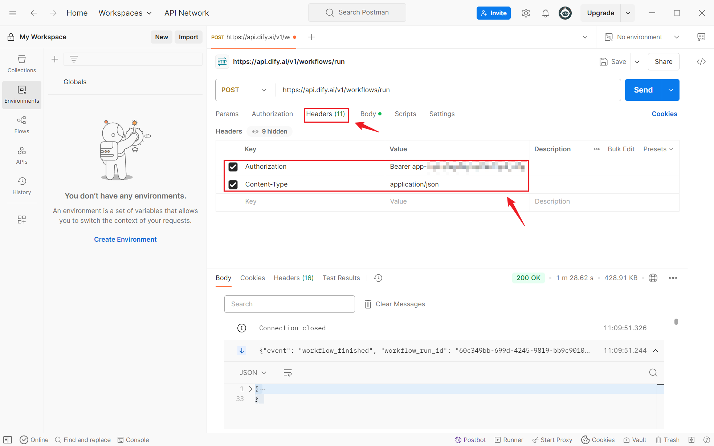

### 3.3 添加请求体

Body 选择 `raw`，格式选择 `JSON`。

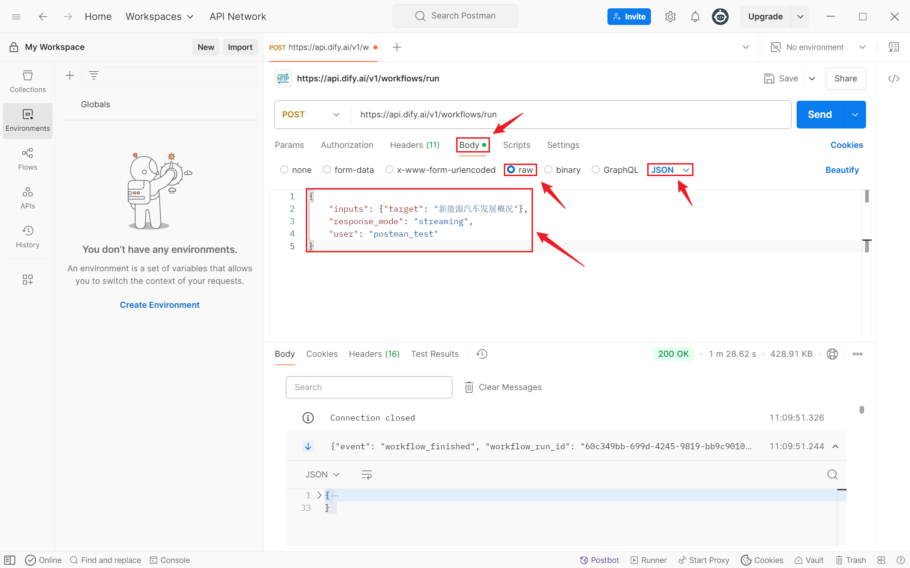

示例请求体：

```json
{
  "inputs": {
    "target": "新能源汽车发展概况"
  },
  "response_mode": "streaming",
  "user": "postman_test"
}
```

这里的 `target` 就是工作流输入变量名，必须和你在 Dify 工作流中定义的字段一致。

### 3.4 发送请求

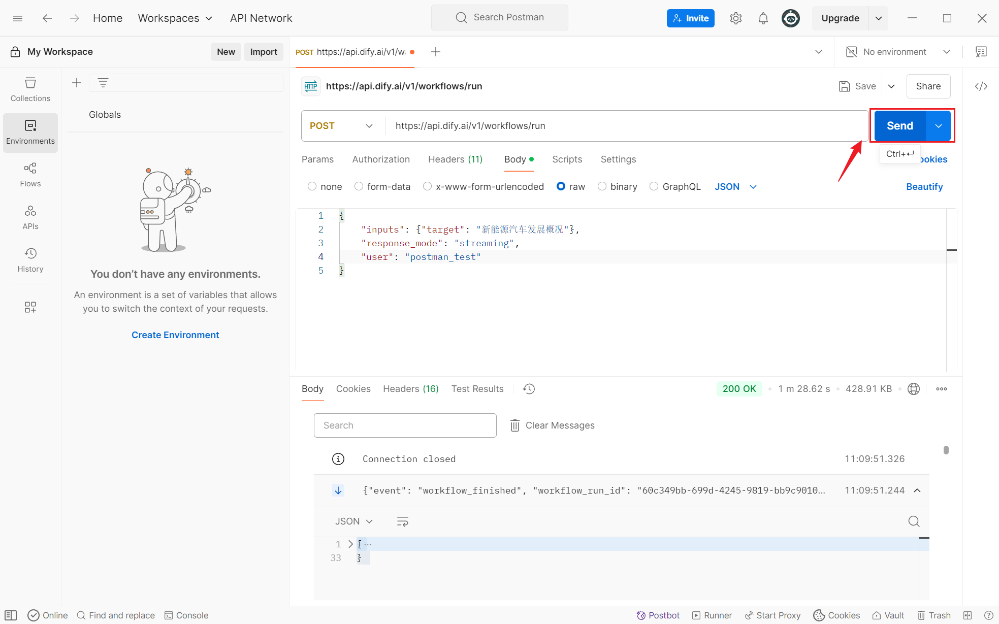

### 3.5 看懂响应

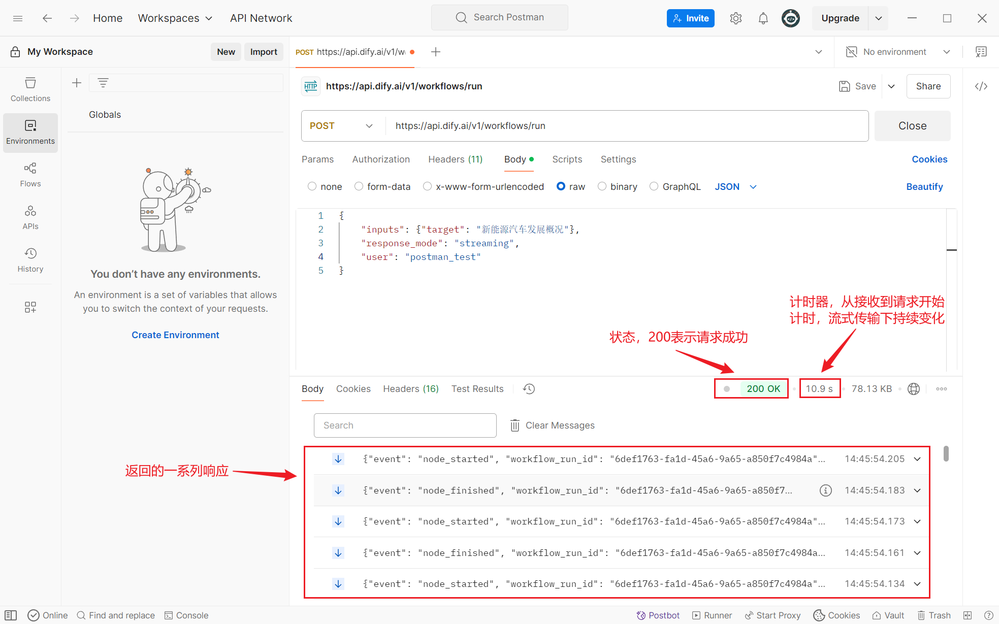

响应开始标志：

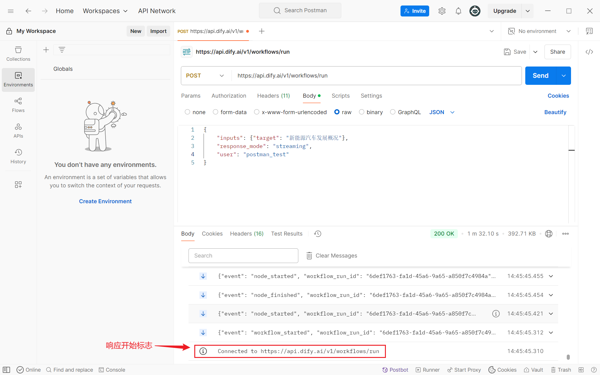

响应结束标志：

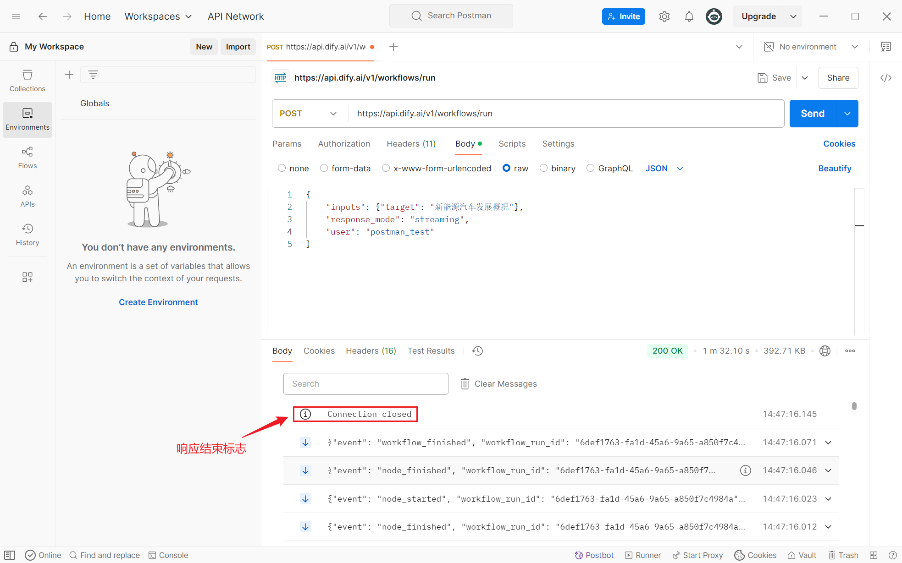

最终响应体携带工作流的最终输出：

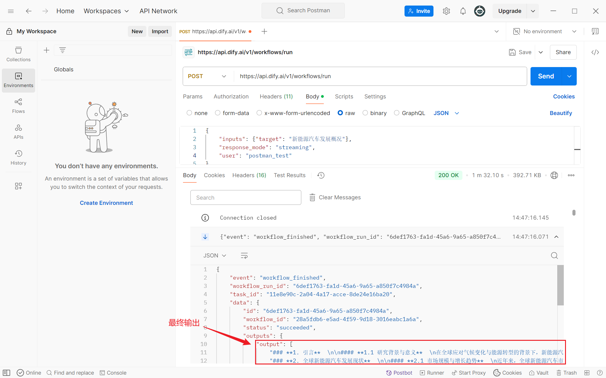

### 3.6 怎么理解返回体

最后一个关键事件通常是：

```json
{
  "event": "workflow_finished",
  "workflow_run_id": "xxx",
  "task_id": "xxx",
  "data": {
    "status": "succeeded",
    "outputs": {
      "output": ["...最终结果..."]
    }
  }
}
```

第一次学习时，把它记成一句话就够了：

> **只要你最终收到了 `workflow_finished`，并且 `status` 是 `succeeded`，这次工作流调用通常就算成功了。**

## 4、在 Dify 后台看运行日志

### 4.1 打开日志页面

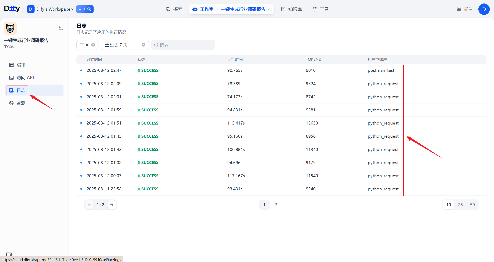

### 4.2 查看结果

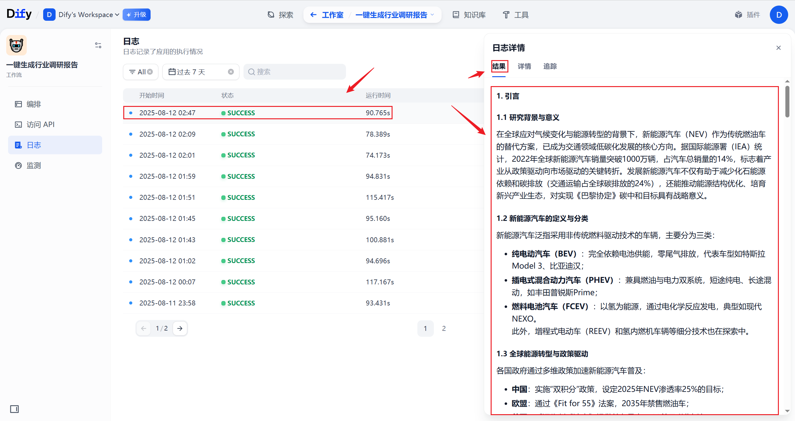

### 4.3 查看详情

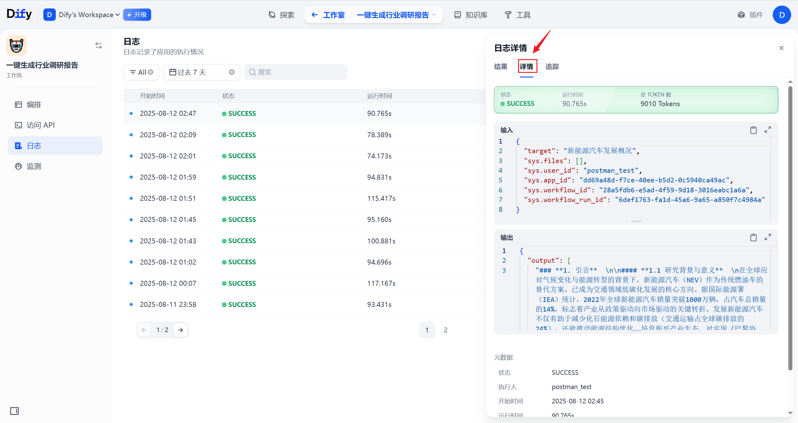

### 4.4 查看追踪信息

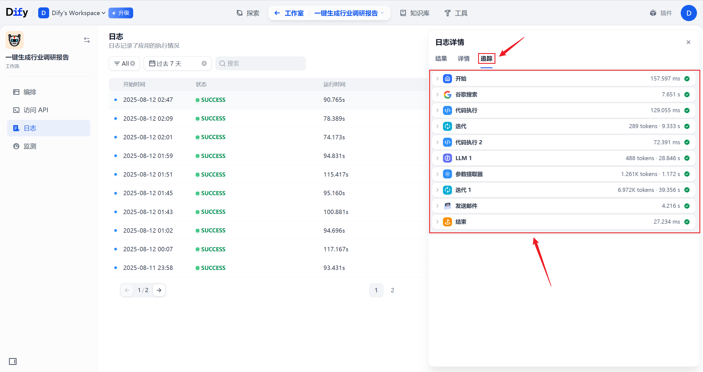

平台日志的价值非常大，因为它能告诉你：

- 这次请求有没有真正进到工作流
- 哪个节点报错了
- 输入变量有没有传对
- 最终输出是不是和代码侧拿到的一致

很多时候，问题并不是 Python 代码写错，而是**工作流内部节点、变量名、工具配置**出了问题。这个时候平台日志会比本地日志更直观。

## 5、用 Python 调用 Dify 工作流

### 5.1 安装依赖

```sh
pip install requests
```

### 5.2 一份更适合真实项目的示例代码

```python
import requests
import json

# 响应返回模式
# 流式，基于 SSE（Server-Sent Events）实现类似打字机输出方式的流式返回
STREAMING_MODE="streaming"
# 阻塞式，等待执行完毕后返回结果（流程较长则可能会被中断）。由于 Dify 云/网关限制，请求在约 100 秒无返回后会超时中断
BLOCKING_MODE="blocking"

# 工作流的API_KEY
API_KEY="{your key}"
# Dify base_url，如果是本地部署，替换为 http://localhost/v1
BASE_URL="https://api.dify.ai/v1"

# 工作流完成标志
WORKFLOW_FINISHED="workflow_finished"
# 工作流成功标志
WORKFLOW_SUCCESS="succeeded"

# 用于启动工作流
def stream_dify_workflow(target, api_key=API_KEY, base_url=BASE_URL, username="python_request", mode=STREAMING_MODE):
    # 拼接用于启动工作流的 url
    url = f"{base_url}/workflows/run"

    # 拼接头信息，包括API Key和数据类型
    headers = {
        "Authorization": f"Bearer {api_key}",
        "Content-Type": "application/json"
    }

    # 拼接请求体
    payload = {
        "inputs": {"target": target},
        "response_mode": mode,
        "user": username
    }

    try:
        # 使用stream=True保持连接打开
        with requests.post(url, headers=headers, json=payload, stream=True) as response:
            if response.status_code != 200:
                print(f"请求失败，状态码: {response.status_code}")
                print(response.text)
                return

            print("=== 开始接收流式响应: ===")
            # 逐行读取服务器推送的数据
            for line in response.iter_lines():
                if line:
                    # 解码
                    decoded_line = line.decode('utf-8')

                    # 将 JSON 中的 Unicode 转义序列（如 \uXXXX）解码为对应字符
                    fixed_line = decoded_line.encode("utf-8").decode("unicode_escape")

                    # 打印由二进制解析为 UTF-8 后的响应
                    print(f"decoded_line: {decoded_line}")
                    # 解码后换行会导致日志非常乱，一般不打开
                    # print(f"fixed_line: {fixed_line}")
                    # print(fixed_line)

                    # 去除SSE格式前缀
                    if(decoded_line.startswith("data: ")):
                        decoded_line=decoded_line[6:]

                        try:
                            # 尝试解析为JSON
                            json_data = json.loads(decoded_line)
                            if(json_data.get("event")==WORKFLOW_FINISHED):
                                print("---> 工作流执行完毕 <---")
                                print(f"{json_data.get("data")=}")
                                data = json_data.get("data")
                                workflow_status = data.get("status")
                                if (workflow_status == WORKFLOW_SUCCESS):
                                    print("---> 工作流执行成功 <---")

                                    try:
                                        # 获取工作流最终输出
                                        result = data.get("outputs").get("output")

                                        # 返回结果
                                        return result
                                    except Exception as e:
                                        print("工作流输出解码错误: ", e)
                                        print("data: ", data)
                                        return None
                                else:
                                    print("---> 工作流执行失败 <---")
                                    return None
                        except Exception as e:
                            print("JSON解析错误: ", e)
                            return None

            print("=== 流式响应结束 ===")

    except requests.exceptions.RequestException as e:
        print(f"请求发生错误: {e}")
        return None


if __name__ == "__main__":
    result = stream_dify_workflow("新能源发展现状")
    print("----------> result <----------")

    # 若成功返回，遍历结果列表并打印最终输出（失败时 result 为 None）
    if result:
        for item in result:
            print(item)
```

### 5.3 代码里最关键的三件事

这段代码最值得你真正看懂的，不是语法，而是这三件事：

1. 通过 `Authorization: Bearer ...` 完成身份认证。
2. 通过 `inputs` 把业务参数传给工作流。
3. 通过监听 `workflow_finished` 事件拿到最终结果。

### 5.4 本地部署版 Dify 怎么改？

如果你调用的是自己部署的 Dify，通常只需要把环境变量改成：

```bash
export DIFY_BASE_URL=http://localhost/v1
export DIFY_API_KEY=your_api_key
```

Windows PowerShell 可改成：

```powershell
$env:DIFY_BASE_URL="http://localhost/v1"
$env:DIFY_API_KEY="your_api_key"
```

## 6、怎么读懂流式日志

### 6.1 日志分为两类

#### 1. 以 data: 开头

这类是真正的工作流运行日志。

```text
decoded_line: data: {"event": "iteration_next", ...}
```

#### 2. 以 event: 开头

这类通常是通信层心跳或事件类型提示。

```text
decoded_line: event: ping
```

### 6.2 真正要抓住的主线

```text
workflow_started
-> node_started / node_finished（每个节点的开始与结束）
-> iteration_next（如果有循环或迭代）
-> workflow_finished
```

一个更适合阅读的日志片段如下：

```text
=== 开始接收流式响应 ===
decoded_line: data: {"event":"workflow_started", ...}
decoded_line: data: {"event":"node_started", "data":{"title":"开始", ...}}
decoded_line: data: {"event":"node_finished", "data":{"title":"开始", "status":"succeeded", ...}}
decoded_line: data: {"event":"node_started", "data":{"title":"谷歌搜索", ...}}
decoded_line: data: {"event":"node_finished", "data":{"title":"谷歌搜索", "status":"succeeded", ...}}
decoded_line: data: {"event":"workflow_finished", "data":{"status":"succeeded", "outputs":{...}}}
```

可以把它理解成：

- `workflow_started`：整次工作流开始执行
- `node_started / node_finished`：某个具体节点开始或结束
- `workflow_finished`：整次流程结束，并在 `outputs` 中给出最终结果

### 6.3 为什么不建议把完整正文原样打印进文档

如果你的工作流输出是一篇长文，不建议把整篇正文原样打印进教学文档。真实项目里更常见的做法是：

1. 在日志里确认 `status` 是否为 `succeeded`
2. 从 `outputs` 中取出最终字段
3. 只打印前几百个字符做调试预览
4. 需要完整内容时再写入文件、数据库或上层接口响应

例如：

```python
final_text = outputs["output"][0]
print(final_text[:300])
```

### 6.4 查看 Dify 后台日志

对比 Dify 后台日志和 Python 控制台日志，最终运行结果应该能互相对应。

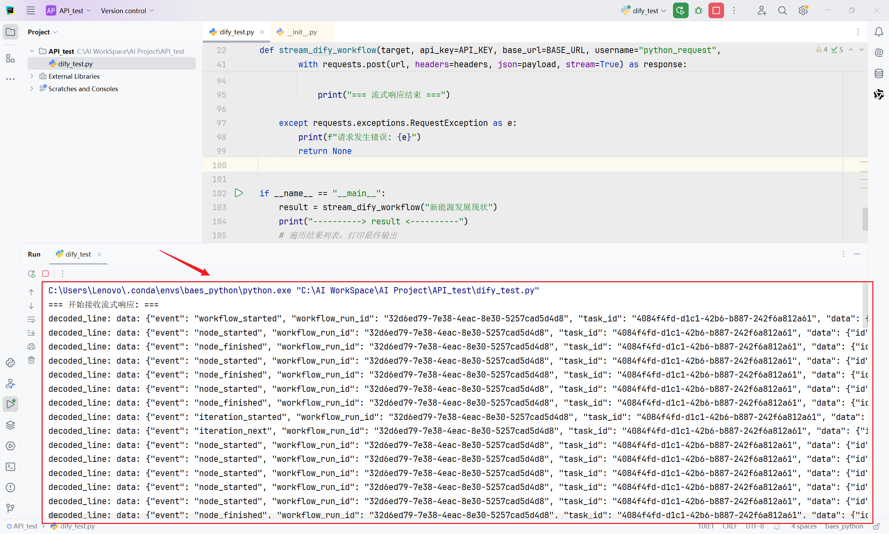

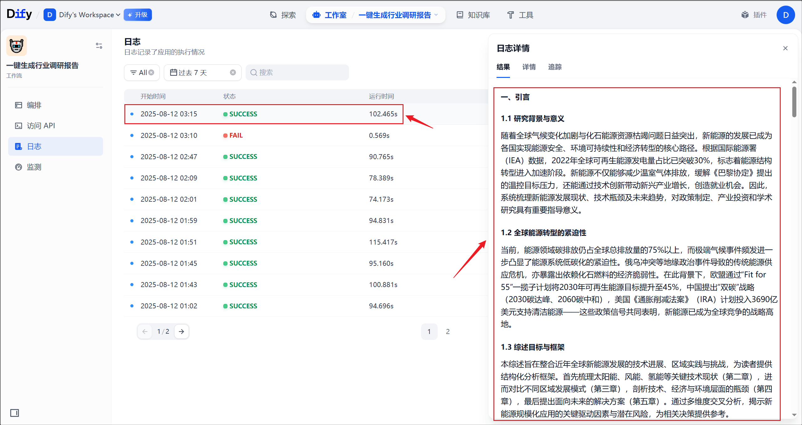

## 7、真实项目里最常见的排查顺序

如果 API 调用失败，建议按下面顺序排查：

1. **先看平台**：工作流是否已发布、API Key 是否对应这个工作流。
2. **再看请求**：URL、Header、`inputs` 字段名、变量类型是否正确。
3. **再看事件流**：有没有收到 `workflow_finished`，`status` 是不是 `succeeded`。
4. **最后看后台日志**：哪一个节点出错，是否是平台内部逻辑问题。

这条顺序比“哪里报错就盯哪里”更稳定，因为它把问题分成了**入口层、请求层、执行层、平台层**四个层次。

---

**章节思考题：**

1. 为什么 Dify 工作流在被 Python 调用之前必须先发布？

   **答案：** 因为只有发布后的工作流才有稳定可调用的版本和对外 API 能力。未发布内容仍处于编辑态，节点、变量和逻辑都可能变化，不适合作为外部代码依赖。

2. `inputs`、`response_mode`、`user` 这三个字段分别解决什么问题？

   **答案：** `inputs` 负责传业务入参；`response_mode` 负责决定返回模式；`user` 用来标识调用来源，便于平台日志和审计区分。

3. 为什么流式响应里不能只盯着第一段输出，而要关注最终结束事件？

   **答案：** 因为中间输出只是过程片段，不能代表这次执行真的成功结束。只有看到 `workflow_finished` 并确认 `status` 正常，才能说明这次调用真正完成了。

4. 如果让你把一个 Dify 工作流接进已有 Python 服务，你会如何向团队解释这条调用链？

   **答案：** 先在 Dify 平台把工作流设计并发布，再拿到 API Key 和接口地址；Python 侧按约定传 `inputs` 发请求，解析流式或阻塞式返回，最后把结果转成自己服务的响应格式，并补上日志与异常处理。

5. 如果 API 调用失败，你会按什么顺序检查：发布状态、API Key、URL、请求体、后台日志？

   **答案：** 先看工作流是否已发布，再核对 API Key 和 URL，然后检查请求体字段名和数据结构，最后去平台后台日志定位具体节点错误。这样最容易区分是调用入口问题，还是工作流内部问题。

**本章小结：**

- **调用前提**：Dify 工作流必须先发布，并创建与之绑定的 API Key。
- **调用核心**：最关键的请求要素是 URL、Authorization、`inputs`、`response_mode` 和 `user`；它们共同决定“调哪个工作流、用什么身份、传什么输入、怎么拿结果”。
- **返回模式要分清**：`blocking` 适合简单调用，`streaming` 更适合真实项目调试与长流程任务。
- **排查主线**：本章最重要的不是背某段代码，而是掌握一条稳定排查路径：**平台先发布并调通 -> Postman / curl 验证 -> Python 接入 -> Dify 日志对照排查**。

**建议下一步：**

- 如果你还要继续接 Coze 平台工作流，进入 [第 5 章 Python 调用 Coze 平台工作流](5-Python调用Coze平台工作流.md)。
- 如果你想把平台能力和 Agent 原理连接起来，进入 [第 21 章 Agent 智能体](21-Agent智能体.md)。
- 如果你准备部署自己的 Dify 环境，进入 [第 7 章 Dify 的 Windows 平台部署](7-Dify的Windows平台部署.md) 或 [第 8 章 企业级大模型部署](8-企业级大模型部署.md)。
