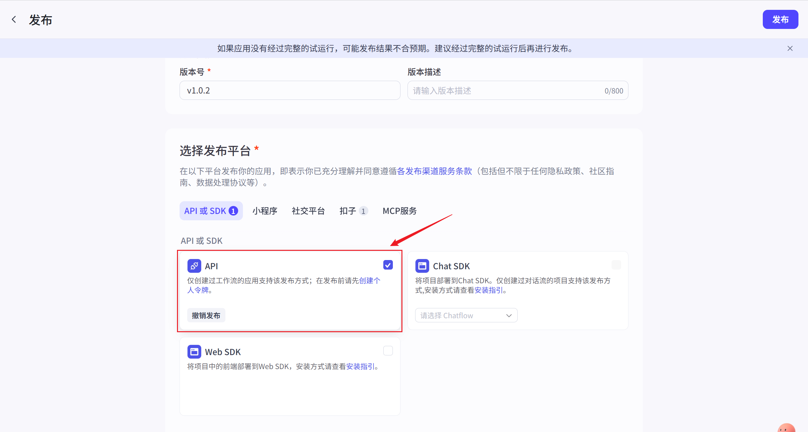
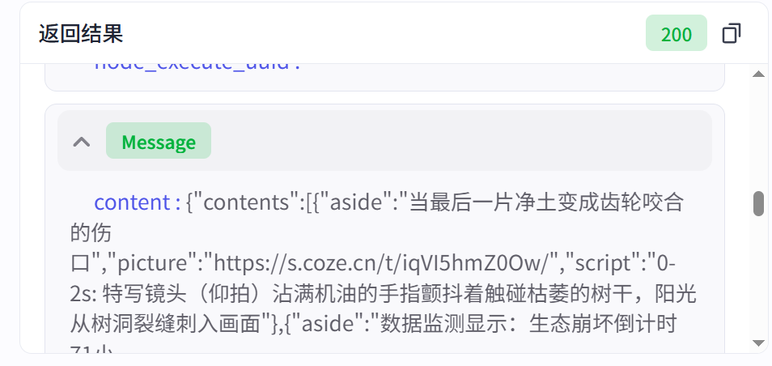
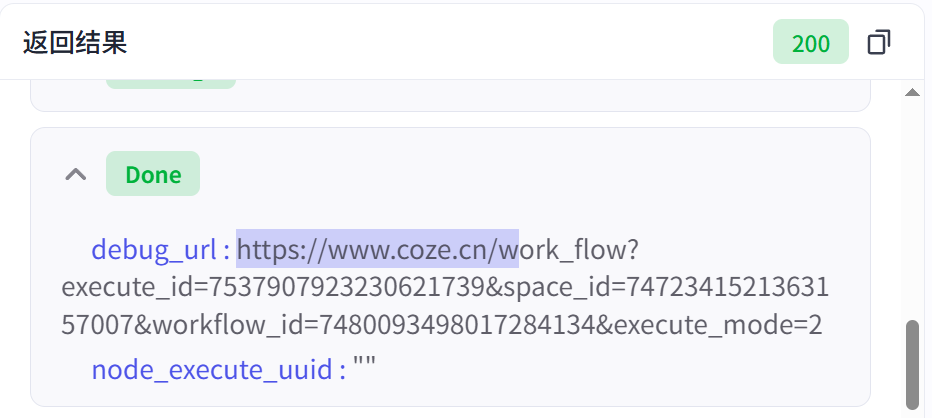
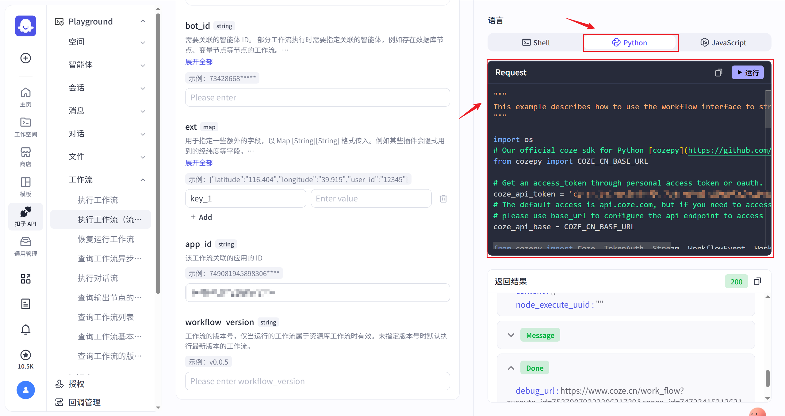
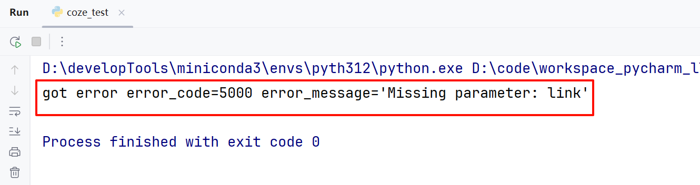
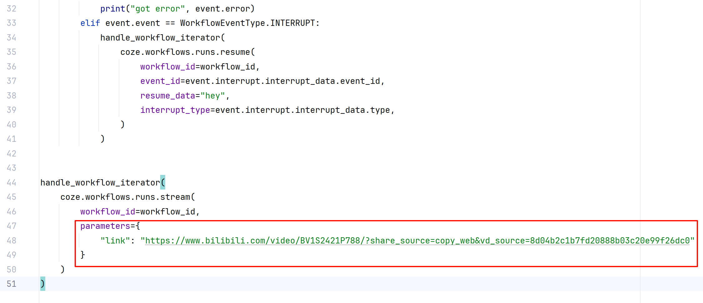
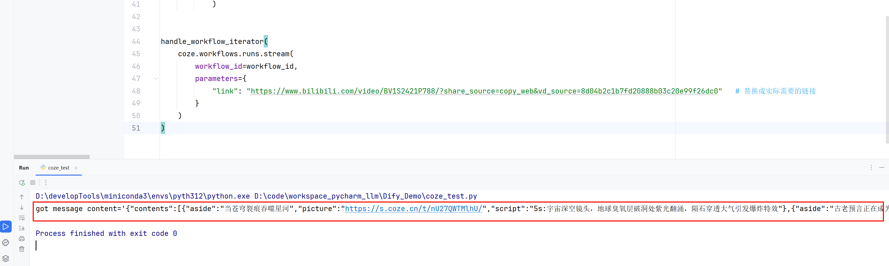
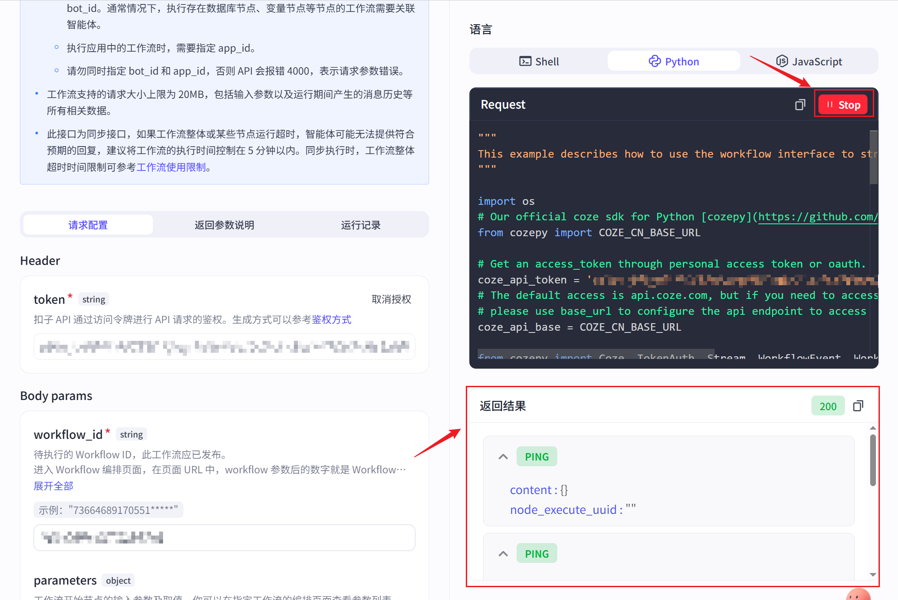

# 5 - Python 调用 Coze 平台工作流

本章偏**平台调用实战**：学会用 API 和 Python 调用你在 Coze 上已搭建好的工作流，把“扣子里的工作流”接进本地代码和业务系统。

---

**本章课程目标：**

- 知道调用前需在 Coze 中**发布 API**，并在 API 调试页面拿到 `workflow_id`、`app_id` 和 API Key。
- 理解 Coze 工作流调用里最关键的请求字段：`workflow_id`、`app_id`、`parameters`。
- 能看懂 Coze 流式返回里的常见事件：`PING`、`Message`、`Done`。
- 能用 **cozepy** 官方 SDK 在本地跑通一次最小调用，并知道真实项目里为什么要用环境变量而不是把密钥写死在代码里。

**学习建议：** 这章和第 4 章最适合对照着看。你会发现两个平台虽然界面、SDK 和字段命名不同，但背后的主线是一样的：**平台发布 -> 鉴权 -> 传业务参数 -> 收事件流 -> 去平台日志核对结果**。

---

## 1、调用前必须先发布 API

Coze 的 API 能力需要通过应用发布功能启用。



这一步的意义和 Dify 很像：只有发布后的工作流，才适合作为外部系统依赖的稳定入口。

## 2、先在平台里把关键信息拿全

### 2.1 API 调试入口

发布成功后，在工作流画布页面可以看到 API 调试入口。


### 2.2 查看 workflow_id 和 app_id

通过 API playground，选择右侧的 Shell 请求方式。

界面中会显示：

- **工作流 ID**：`workflow_id`
- **应用 ID**：`app_id`


可以先这样理解：

- `workflow_id`：这次到底执行哪一个工作流
- `app_id`：这个工作流属于哪个应用上下文

### 2.3 生成并授权 API Key

左侧窗口向下滑动，可以看到 token（即 API Key），点击“授权”按钮。


点击后会自动生成并填充 API Key。


右侧的 Shell 命令窗口会同步更新。

### 2.4 添加参数

请求体中的 `parameters` 对象用于向工作流传递参数，该对象的每个属性都对应工作流中的一个输入变量。


这也是 Coze 调用里最容易出错的地方。因为它不是“差不多就行”，而是**字段名、类型、结构都必须对齐平台里的定义**。

### 2.5 运行

可以直接点击 Shell 命令窗口右上角的“运行”按钮。


## 3、看懂最小调用请求

平台里看到的 curl 命令大致如下：

```sh
curl -X POST 'https://api.coze.cn/v1/workflow/stream_run' \
-H "Authorization: Bearer {api_key}" \
-H "Content-Type: application/json" \
-d '{
  "workflow_id": "{workflow_id}",
  "app_id": "{app_id}",
  "parameters": {
    "link": "https://example.com/video"
  }
}'
```

这里最关键的字段只有三个：

- `workflow_id`：执行哪个工作流
- `app_id`：归属哪个应用
- `parameters`：传给工作流的实际业务参数

> **注意：** JSON 标准不支持注释，所以请求体里不要写 `# 说明文字` 这种内容。

## 4、怎么看流式结果

### 4.1 运行结果界面


### 4.2 Message



`Message` 才是携带真正业务内容的事件类型，此处的 `content` 就是工作流某一步的输出。

### 4.3 Done



`Done` 表示流式响应结束，通常出现在所有 `Message` 之后。

### 4.4 你真正需要记住的三类信号

- **PING**：心跳包，只负责保活连接，通常可忽略。
- **Message**：真正携带内容的事件。
- **Done**：整次流式输出结束。

> **可这样记：** 写代码时，重点关注 `Message` 和结束信号；`PING` 不是业务结果，只是说明连接还活着。

## 5、用 Python 调用 Coze 工作流

### 5.1 官方 Python SDK 入口

Coze 提供了官方 Python SDK：`cozepy`。



### 5.2 安装依赖

```sh
pip install cozepy
```

### 5.3 示例源码

````python
"""
This example describes how to use the workflow interface to stream chat.
"""

import os
# Our official coze sdk for Python [cozepy](https://github.com/coze-dev/coze-py)
from cozepy import COZE_CN_BASE_URL

# Get an access_token through personal access token or oauth.
coze_api_token = '{API_KEY}'
# The default access is api.coze.com, but if you need to access api.coze.cn,
# please use base_url to configure the api endpoint to access
coze_api_base = COZE_CN_BASE_URL

from cozepy import Coze, TokenAuth, Stream, WorkflowEvent, WorkflowEventType  # noqa

# Init the Coze client through the access_token.
coze = Coze(auth=TokenAuth(token=coze_api_token), base_url=coze_api_base)

# Create a workflow instance in Coze, copy the last number from the web link as the workflow's ID.
workflow_id = '{WORKFLOW_ID}'


# The stream interface will return an iterator of WorkflowEvent. Developers should iterate
# through this iterator to obtain WorkflowEvent and handle them separately according to
# the type of WorkflowEvent.
def handle_workflow_iterator(stream: Stream[WorkflowEvent]):
    for event in stream:
        if event.event == WorkflowEventType.MESSAGE:
            print("got message", event.message)
        elif event.event == WorkflowEventType.ERROR:
            print("got error", event.error)
        elif event.event == WorkflowEventType.INTERRUPT:
            handle_workflow_iterator(
                coze.workflows.runs.resume(
                    workflow_id=workflow_id,
                    event_id=event.interrupt.interrupt_data.event_id,
                    resume_data="hey",
                    interrupt_type=event.interrupt.interrupt_data.type,
                )
            )


handle_workflow_iterator(
    coze.workflows.runs.stream(
        workflow_id=workflow_id
    )
)

### 5.4 在本地 PyCharm 中运行

当你直接拷贝平台生成代码时，如果工作流定义了输入变量，但 `stream()` 调用里没有传 `parameters`，就会报错。



平台里的提示也已经很清楚：



**处理方式**：在从 Coze 平台拷贝的代码基础上，为 `stream()` 调用增加 **parameters** 参数：

```python
handle_workflow_iterator(
    coze.workflows.runs.stream(
        workflow_id=workflow_id,
        parameters={
            "link": "https://www.bilibili.com/video/BV1S2421P788/?share_source=copy_web&vd_source=8d04b2c1b7fd20888b03c20e99f26dc0"   # 替换成实际需要的链接
        }
    )
)
````

### 5.4 最终代码

```python
"""
This example describes how to use the workflow interface to stream chat.
"""

import os
# Our official coze sdk for Python [cozepy](https://github.com/coze-dev/coze-py)
from cozepy import COZE_CN_BASE_URL

# Get an access_token through personal access token or oauth.
coze_api_token = 'cztei_hXYOqnustyYyhrSuGFl4tgcxJ9E2KjYLPnHvcEcoWRwWvujWU0sPqka8xyQ1wsCyi'
# The default access is api.coze.com, but if you need to access api.coze.cn,
# please use base_url to configure the api endpoint to access
coze_api_base = COZE_CN_BASE_URL

from cozepy import Coze, TokenAuth, Stream, WorkflowEvent, WorkflowEventType  # noqa

# Init the Coze client through the access_token.
coze = Coze(auth=TokenAuth(token=coze_api_token), base_url=coze_api_base)

# Create a workflow instance in Coze, copy the last number from the web link as the workflow's ID.
workflow_id = '7537267958432858127'


# The stream interface will return an iterator of WorkflowEvent. Developers should iterate
# through this iterator to obtain WorkflowEvent and handle them separately according to
# the type of WorkflowEvent.
def handle_workflow_iterator(stream: Stream[WorkflowEvent]):
    for event in stream:
        if event.event == WorkflowEventType.MESSAGE:
            print("got message", event.message)
        elif event.event == WorkflowEventType.ERROR:
            print("got error", event.error)
        elif event.event == WorkflowEventType.INTERRUPT:
            handle_workflow_iterator(
                coze.workflows.runs.resume(
                    workflow_id=workflow_id,
                    event_id=event.interrupt.interrupt_data.event_id,
                    resume_data="hey",
                    interrupt_type=event.interrupt.interrupt_data.type,
                )
            )


handle_workflow_iterator(
    coze.workflows.runs.stream(
        workflow_id=workflow_id,
        parameters={
            "link": "https://www.bilibili.com/video/BV1S2421P788/?share_source=copy_web&vd_source=8d04b2c1b7fd20888b03c20e99f26dc0"   # 替换成实际需要的链接
        }
    )
)
```

### 5.5 运行结果



## 6、除了 SDK，还可以在平台侧运行

如果你只是想先确认工作流本身能正常输出，也可以直接在平台里测试。



真实项目中，推荐的顺序通常是：

1. 先在平台确认工作流逻辑跑通
2. 再用 API playground 验证请求结构
3. 最后再接入 Python 代码

这样最容易把问题分层定位，而不是平台和代码一起调，最后什么都分不清。

---

**章节思考题：**

1. `workflow_id`、`app_id`、API Key 在 Coze 工作流调用里分别承担什么作用？

   **答案：** `workflow_id` 用来指定执行哪个工作流，`app_id` 用来标识所属应用上下文，API Key 负责身份认证和调用授权。三者分别对应目标对象、应用归属和安全校验。

2. 为什么 `parameters` 是 Coze 调用里最容易出错的一层？

   **答案：** 因为它必须和平台里定义的入参名称、类型、结构严格对齐，只要字段名错、类型不对或层级不匹配，工作流就拿不到值或直接报错。

3. 为什么流式事件里要单独处理 ERROR 和 INTERRUPT，而不是只打印正文？

   **答案：** 因为 ERROR 和 INTERRUPT 不是普通正文，而是说明这次执行是否真正成功完成的关键信号。只打印正文会让你误以为任务结束了，实际可能已经失败或等待干预。

4. 如果你要把 Coze 工作流接入一个 Python 服务端接口，会如何设计“参数接收 -> 调用工作流 -> 返回结果”这条链路？

   **答案：** 先在接口层接收并校验业务参数，再在服务层把参数映射成 Coze 所需的 `parameters` 发起调用，最后统一解析正常结果、异常事件和中断状态，返回给前端一致的响应结构。

5. 当调用结果不符合预期时，你会如何利用平台调试信息和代码日志一起定位问题？

   **答案：** 先在平台调试页确认每个入参是否进入了正确节点，再看节点执行结果和报错位置；同时在代码侧记录请求体、事件流和最终返回。把平台内视角和代码外视角对起来，问题通常很快就能定位。

**本章小结：**

- **调用前提**：Coze 工作流要先发布 API，并确认 `workflow_id`、`app_id` 和 API Key 都已拿到。
- **调用核心**：`cozepy` 帮你封装了请求与事件流，但真正最关键的仍然是 `parameters` 是否和工作流输入变量一一对齐。
- **事件流不要只看正文**：Coze 的流式执行除了正常输出，还可能出现 ERROR、INTERRUPT 等事件。学这章时，重点不是“能打印出一段文本”，而是能正确理解一次工作流执行到底是成功完成、等待干预，还是中途失败。
- **调试主线**：和第 4 章一样，平台调试和代码调用要相互印证；一旦结果异常，优先看参数映射、事件流、平台侧调试输出和本地日志是否能互相对上。

**建议下一步：** 如果你想继续走 Coze 本地化和私有化路线，可以看 [第 6 章 Coze 的 Windows 平台部署](6-Coze的Windows平台部署.md)；如果你想从平台调用进一步过渡到代码框架主线，也可以回到 [第 9 章 LangChain 概述与架构](9-LangChain概述与架构.md) 开始进入 LangChain 学习。
