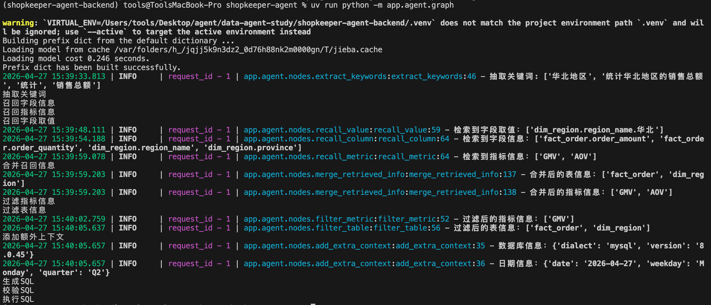

# 13 - 电商问数：SQL 生成前的信息过滤与补全

---

**本章课程目标：**

- 理解为什么召回信息合并之后，还要继续过滤表、字段和指标。
- 掌握 `filter_table` 如何让大模型从候选表结构中选出必要表和字段。
- 掌握 `filter_metric` 如何让大模型从候选指标中选出必要指标。
- 理解为什么要把 `table_infos`、`metric_infos` 转成 YAML 后放进提示词。
- 看懂 `add_extra_context` 如何补充当前日期、星期、季度、数据库方言和版本。

**学习建议：** 本章建议按 **“先减少噪声 -> 再补齐环境”** 的顺序理解。过滤节点负责把上一章合并出来的上下文变短、变准；额外上下文节点负责补充模型不能凭空猜的信息，比如今天是哪天、数据库是什么类型。

**对应代码分支：** `13-agent-filter-extra-context`

---

## 1、本章在问数链路中的位置

上一章完成了 `merge_retrieved_info`，把字段、指标、字段取值三路召回结果整理成两份核心上下文：

```text
table_infos   # 按表组织好的表结构上下文
metric_infos  # 整理后的指标上下文
```

但这里的“整理好”，还不等于“足够精确”。

召回阶段通常会偏保守：宁可多保留一些候选，也尽量不要漏掉关键表、字段或指标。这样能提高召回率，但也会带来噪声。本章要实现的三个节点，就是在 SQL 生成前做最后一轮准备：

```text
filter_table       # 过滤表和字段
filter_metric      # 过滤指标
add_extra_context  # 添加日期、数据库等额外上下文
```

把它们放回完整链路中看，位置如下：

```text
用户问题
  -> extract_keywords
  -> recall_column / recall_metric / recall_value
  -> merge_retrieved_info
  -> filter_table / filter_metric
  -> add_extra_context
  -> generate_sql
```


简单来说：

```text
filter_table / filter_metric -> 把业务上下文筛干净
add_extra_context            -> 把运行环境信息补完整
```

---

## 2、为什么合并后还要过滤

以上一章的测试问题为例：

```text
统计华北地区的销售总额
```

合并后的 `table_infos` 里可能会出现：

```text
fact_order   # 订单事实表，需要
dim_region   # 地区维度表，需要
dim_date     # 日期维度表，当前问题可能不需要
```

`fact_order` 和 `dim_region` 是合理的，因为要统计销售总额，并按地区过滤。但 `dim_date` 在这个问题里不一定需要，因为用户没有提到时间范围。

字段和指标也一样。一张需要保留的表里，可能有很多暂时用不上的字段；上一章可能召回了 `GMV` 和 `AOV`，但用户问“销售总额”时，真正需要的通常是 `GMV`，不是客单价 `AOV`。

如果把这些冗余信息全部交给 SQL 生成模型，会有两个问题：

- 上下文噪声变多，模型更容易选错表、字段或指标；
- 提示词变长，调用大模型的 token 成本也会增加。

所以这里需要一轮精筛：

```text
召回阶段：宁可多一点，避免漏掉
合并阶段：把候选整理成结构化上下文
过滤阶段：删掉明显无关项，减少干扰
生成阶段：基于更干净的上下文生成 SQL
```

这一步不是为了让模型“知道更多”，而是为了让模型“少被无关信息打扰”。

---

## 3、先看三个节点的分工

本章三个节点都在为 SQL 生成做准备，但分工不同：

| 节点                | 处理对象             | 输出结果               | 作用                           |
| ------------------- | -------------------- | ---------------------- | ------------------------------ |
| `filter_table`      | `table_infos`        | 过滤后的表和字段       | 保留本次查询真正需要的 schema  |
| `filter_metric`     | `metric_infos`       | 过滤后的指标           | 保留本次查询真正需要的业务指标 |
| `add_extra_context` | 当前日期、数据库连接 | `date_info`、`db_info` | 补齐相对时间和 SQL 方言信息    |

可以把它们理解成两类动作：

```text
过滤：filter_table、filter_metric
补全：add_extra_context
```

过滤节点处理的是业务上下文，来自元数据知识库；补全节点处理的是运行环境上下文，来自程序运行时和真实数仓连接。

---

## 4、为什么要把上下文转成 YAML

`table_infos` 和 `metric_infos` 在 Python 程序里是列表、字典等对象。它们不能直接“作为对象”交给大模型，只能先转成文本。

常见做法有两种：

```text
Python 对象 -> JSON 字符串
Python 对象 -> YAML 字符串
```

本项目里选择 YAML：

```python
yaml.dump(table_infos, allow_unicode=True, sort_keys=False)
```

这样做有几个好处：

- 层级结构清楚，表、字段、字段属性更容易看；
- `allow_unicode=True` 可以让中文正常显示，而不是转成 Unicode 编码；
- `sort_keys=False` 可以保留原有字段顺序，不会按字母顺序打乱；
- 放进提示词后，比 Python 对象的默认打印形式更适合模型阅读。

比如 `table_infos` 转成 YAML 后，会更像这样：

```yaml
- name: fact_order
  role: fact
  description: 订单事实表
  columns:
    - name: order_amount
      type: decimal
      role: measure
      examples: []
      description: 订单金额
      alias:
        - 成交金额
        - 销售金额
- name: dim_region
  role: dimension
  description: 地区维度表
  columns:
    - name: region_name
      type: string
      role: dimension
      examples:
        - 华北
      description: 地区名称
      alias:
        - 大区
```

这种格式对人和模型都更友好。后面的 `filter_table` 和 `filter_metric` 都采用这个方式，把结构化对象转换成提示词里的可读文本。

---

## 5、表过滤节点：filter_table


`filter_table` 读取的是上一章生成的：`state["table_infos"]`

输入给大模型的大致内容包括：

- 用户问题 `query`
- 候选表及字段信息 `table_infos`

模型需要返回一个简单的 JSON 对象，表示“保留哪些表，以及每张表里保留哪些字段”。

例如：

```json
{
  "fact_order": ["order_amount", "region_id"],
  "dim_region": ["region_id", "region_name"]
}
```

这个结果的含义是：

- 保留 `fact_order`，只保留其中的 `order_amount`、`region_id`；
- 保留 `dim_region`，只保留其中的 `region_id`、`region_name`；
- 其他表和字段都不要。

这里特意让模型返回“选择结果”，而不是完整的过滤后表结构。

原因很实际：完整的 `table_infos` 层级比较深，有表名、表角色、表描述、字段类型、字段角色、示例值、别名等信息。让模型原样重写这整套结构，出错概率会更高。

更稳的做法是：**让模型只做选择题，返回表名和字段名；真正的裁剪由程序完成。**

### 5.1 filter_table 提示词关注什么

项目对应提示词路径：`shopkeeper-agent/prompts/filter_table_info.prompt`

这份提示词的定位是：让模型扮演查询规划专家，在候选表和字段中选出回答当前问题必须使用的部分。

核心规则可以概括成几条：

- 只能从候选表和候选字段中选择；
- 不能新增表、不能新增字段、不能修改字段名；
- 每张保留下来的表，至少要有一个字段被选中；
- 字段是否保留，以“本次查询是否实际使用”为标准；
- 如果选择多张表，要保留 `join` 所需的主外键字段；
- 只输出 JSON 对象，不输出解释文字。

输出格式固定为：

```json
{{
    "表名1":["字段1", "字段2", "..."],
    "表名2":["字段1", "字段2", "..."]
}}
```

这个设计利用了模型的语义判断能力，同时避免让模型重写复杂结构。

### 5.2 filter_table 核心代码

项目对应文件路径：`app/agent/nodes/filter_table.py`

```python
import yaml
from langchain_core.output_parsers import JsonOutputParser
from langchain_core.prompts import PromptTemplate
from langgraph.runtime import Runtime

from app.agent.context import DataAgentContext
from app.agent.llm import llm
from app.agent.state import DataAgentState, TableInfoState
from app.core.log import logger
from app.prompt.prompt_loader import load_prompt


async def filter_table(state: DataAgentState, runtime: Runtime[DataAgentContext]):
    """根据用户问题裁剪候选表结构上下文"""

    writer = runtime.stream_writer
    writer("过滤表信息")

    query = state["query"]
    table_infos: list[TableInfoState] = state["table_infos"]

    # table_infos 是嵌套结构，转成 YAML 后更适合放进提示词，也保留中文字段说明
    prompt = PromptTemplate(
        template=load_prompt("filter_table_info"),
        input_variables=["query", "table_infos"],
    )
    # filter_table_info prompt 要求模型只输出 JSON 对象：表名 -> 字段名列表
    output_parser = JsonOutputParser()
    # LCEL 管道：填充提示词 -> 调用模型 -> 解析 JSON
    chain = prompt | llm | output_parser

    result = await chain.ainvoke(
        {
            "query": query,
            "table_infos": yaml.dump(table_infos, allow_unicode=True, sort_keys=False),
        }
    )
    # 模型只负责选择，程序根据选择结果从原始 TableInfoState 中裁剪，避免模型重写复杂结构出错
    filtered_table_infos: list[TableInfoState] = []
    for table_info in table_infos:
        if table_info["name"] in result:
            table_info["columns"] = [
                column_info
                for column_info in table_info["columns"]
                if column_info["name"] in result[table_info["name"]]
            ]
            filtered_table_infos.append(table_info)

    logger.info(
        f"过滤后的表信息：{[filtered_table_info['name'] for filtered_table_info in filtered_table_infos]}"
    )
    return {"table_infos": filtered_table_infos}
```

这段代码可以拆成四步。

第一步，读取用户问题和上一章合并出来的表结构：

```python
query = state["query"]
table_infos: list[TableInfoState] = state["table_infos"]
```

第二步，构建一条最小 LCEL 链：

```python
chain = prompt | llm | output_parser
```

这里使用 `JsonOutputParser`，是因为提示词要求模型只输出 JSON 对象。解析后，`result` 就是 Python 字典。

第三步，把 `table_infos` 序列化成 YAML 后传给模型：

```python
yaml.dump(table_infos, allow_unicode=True, sort_keys=False)
```

第四步，根据模型返回的字典裁剪原始表结构。

这里没有在遍历 `table_infos` 时直接 `remove` 元素。因为遍历列表时删除元素，容易造成索引错位，导致漏处理。更稳的方式是新建一个列表：

```python
filtered_table_infos: list[TableInfoState] = []
```

需要保留的表，再追加进去。

字段过滤则使用列表推导式：

```python
table_info["columns"] = [
    column_info
    for column_info in table_info["columns"]
    if column_info["name"] in result[table_info["name"]]
]
```

最后返回：

```python
return {"table_infos": filtered_table_infos}
```

返回同名 key 会覆盖 `state["table_infos"]`，后续节点读取到的就是过滤后的表结构。

---

## 6、指标过滤节点：filter_metric


`filter_metric` 的目标和 `filter_table` 类似，只是它处理的是指标。

上一章合并后的 `metric_infos` 里可能有多个候选指标：

```text
GMV
AOV
订单数
退款金额
```

这些指标可能都和用户问题有一点关系，但不一定都需要进入最终 SQL 生成。

比如用户问：

```text
统计华北地区的销售总额
```

这里最直接相关的是销售总额，也就是 `GMV` 或成交额口径。`AOV` 是客单价，通常不应该保留。

所以 `filter_metric` 会让大模型根据用户问题，从候选指标中选择真正需要的指标。模型输出是一个 JSON 数组：

```json
["GMV"]
```

如果当前问题不需要任何指标，也允许输出空数组：

```json
[]
```

这个“允许为空”很重要。否则模型可能为了有输出而硬选一个指标，反而污染后续 SQL 生成。

### 6.1 filter_metric 提示词关注什么

项目对应提示词路径：`shopkeeper-agent/prompts/filter_metric_info.prompt`

这份提示词的核心约束是：

- 只能从候选指标中选择；
- 不能新增指标，不能修改指标含义；
- 只有本次问题确实用于度量、统计、对比、计算结果的指标才保留；
- 仅用于筛选、分组或限定范围的字段，不视为指标；
- 如果候选指标都不适合，返回空数组；
- 只输出 JSON 数组，不输出解释文字。

举个简单例子：

```text
用户问题：在职实习生有哪些？
候选指标：实习生人数、在职人数
输出：[]
```

因为这个问题更像是在查明细对象，不是在统计指标。提示词里明确允许空数组，就是为了避免模型强行挑指标。

### 6.2 filter_metric 核心代码

项目对应文件路径：`app/agent/nodes/filter_metric.py`

```python
import yaml
from langchain_core.output_parsers import JsonOutputParser
from langchain_core.prompts import PromptTemplate
from langgraph.runtime import Runtime

from app.agent.context import DataAgentContext
from app.agent.llm import llm
from app.agent.state import DataAgentState, MetricInfoState
from app.core.log import logger
from app.prompt.prompt_loader import load_prompt


async def filter_metric(state: DataAgentState, runtime: Runtime[DataAgentContext]):
    """根据用户问题裁剪候选指标上下文"""

    writer = runtime.stream_writer
    writer("过滤指标信息")

    query = state["query"]
    metric_infos: list[MetricInfoState] = state["metric_infos"]

    # metric_infos 转成 YAML 后作为候选项交给模型，模型只需要返回被选中的指标名称
    prompt = PromptTemplate(
        template=load_prompt("filter_metric_info"),
        input_variables=["query", "metric_infos"],
    )
    # filter_metric_info prompt 要求模型只输出 JSON 数组
    output_parser = JsonOutputParser()
    # LCEL 管道：填充提示词 -> 调用模型 -> 解析 JSON
    chain = prompt | llm | output_parser

    result = await chain.ainvoke(
        {
            "query": query,
            "metric_infos": yaml.dump(
                metric_infos, allow_unicode=True, sort_keys=False
            ),
        }
    )
    # 用模型返回的指标名称过滤原始结构，保留描述 依赖字段 别名等完整上下文
    filtered_metric_infos = [
        metric_info
        for metric_info in metric_infos
        if metric_info["name"] in result
    ]

    logger.info(
        f"过滤后的指标信息：{[filtered_metric_info['name'] for filtered_metric_info in filtered_metric_infos]}"
    )
    return {"metric_infos": filtered_metric_infos}
```

这段代码比 `filter_table` 更短，因为指标没有“表 -> 字段”这种嵌套层级。

模型返回的是指标名列表，例如：

```python
["GMV"]
```

程序只需要保留名称在 `result` 中出现的指标：

```python
filtered_metric_infos = [
    metric_info
    for metric_info in metric_infos
    if metric_info["name"] in result
]
```

最后同样覆盖原来的状态：

```python
return {"metric_infos": filtered_metric_infos}
```

---

## 7、过滤节点在图里的并行关系

`filter_table` 和 `filter_metric` 都依赖 `merge_retrieved_info` 的结果，但它们彼此之间没有依赖关系。

所以在 `graph.py` 中，它们是从同一个节点分出去的：

项目对应文件路径：`shopkeeper-agent/app/agent/graph.py`

```python
graph_builder.add_edge("merge_retrieved_info", "filter_table")
graph_builder.add_edge("merge_retrieved_info", "filter_metric")

graph_builder.add_edge("filter_table", "add_extra_context")
graph_builder.add_edge("filter_metric", "add_extra_context")
```

意思是：

```text
merge_retrieved_info 完成
  -> filter_table 和 filter_metric 都可以执行
  -> 两者都完成后，再进入 add_extra_context
```

这里的“并行”是从图结构角度说的：两者没有先后依赖，都是对合并结果做精筛。

---

## 8、额外上下文节点：add_extra_context


表和指标过滤完成后，业务上下文已经比较干净了。但 SQL 生成还需要一些不属于表结构的外部信息。

例如用户问：

```text
统计今年华北地区的销售总额
统计本季度 GMV
查询上个月订单量
```

这些问题里都有相对时间表达：

```text
今年
本季度
上个月
```

模型要把它们转换成 SQL 条件，就必须知道当前日期。

再比如，不同数据库的 SQL 方言并不完全一致。MySQL、PostgreSQL、Hive、ClickHouse 在日期函数、分页语法、类型转换等方面都有差异。生成 SQL 之前告诉模型数据库方言和版本，可以减少模型写出不兼容语法的概率。

所以 `add_extra_context` 会补两类信息：

```text
date_info  # 当前日期、星期、季度
db_info    # 数据库方言、数据库版本
```

### 8.1 补齐 State 和 Context

项目对应文件路径：`shopkeeper-agent/app/agent/state.py`

```python
class DateInfoState(TypedDict):
    date: str
    weekday: str
    quarter: str


class DBInfoState(TypedDict):
    dialect: str
    version: str


class DataAgentState(TypedDict):
    # 前面章节已有字段省略...

    date_info: DateInfoState  # 当前日期 星期和季度信息
    db_info: DBInfoState  # 数据库方言和版本信息
```

`DateInfoState` 和 `DBInfoState` 定义了两份上下文的结构。`DataAgentState` 里加入 `date_info`、`db_info` 后，后续的 `generate_sql` 节点就可以稳定读取它们。

`add_extra_context` 还需要访问数仓数据库，查询数据库版本和方言，所以 `DataAgentContext` 中要有 `dw_mysql_repository`。

项目对应文件路径：`shopkeeper-agent/app/agent/context.py`

```python
from app.repositories.mysql.dw.dw_mysql_repository import DWMySQLRepository


class DataAgentContext(TypedDict):
    # 前面章节已有字段省略...

    dw_mysql_repository: DWMySQLRepository
```

这里使用的是 `DWMySQLRepository`，不是 `MetaMySQLRepository`。

原因是：

- `Meta MySQL` 保存表、字段、指标等元数据；
- `DW MySQL` 模拟真实数仓，SQL 最终也会在这里校验和执行；
- 数据库方言和版本应该以真实执行 SQL 的数据库为准。

### 8.2 add_extra_context 核心代码

项目对应文件路径：`shopkeeper-agent/app/agent/nodes/add_extra_context.py`

```python
from datetime import date

from langgraph.runtime import Runtime

from app.agent.context import DataAgentContext
from app.agent.state import DataAgentState, DateInfoState, DBInfoState
from app.core.log import logger


async def add_extra_context(state: DataAgentState, runtime: Runtime[DataAgentContext]):
    """补齐 SQL 生成所需的日期和数据库环境信息"""

    dw_mysql_repository = runtime.context["dw_mysql_repository"]

    # 当前日期信息会帮助模型处理“今天 本月 本季度 最近 N 天”等相对时间表达
    today = date.today()
    date_str = today.strftime("%Y-%m-%d")
    weekday = today.strftime("%A")
    quarter = f"Q{(today.month - 1) // 3 + 1}"
    date_info = DateInfoState(date=date_str, weekday=weekday, quarter=quarter)

    # 数据库方言和版本会影响函数名 日期运算 limit 语法等 SQL 细节
    db = await dw_mysql_repository.get_db_info()
    db_info = DBInfoState(**db)
    logger.info(f"数据库信息：{db_info}")
    logger.info(f"日期信息：{date_info}")
    return {"date_info": date_info, "db_info": db_info}
```

这段代码做两件事。

第一，生成当前日期信息：

```python
today = date.today()
date_str = today.strftime("%Y-%m-%d")
weekday = today.strftime("%A")
quarter = f"Q{(today.month - 1) // 3 + 1}"
```

`date_str` 是日期字符串，例如：

```text
2026-04-27
```

`weekday` 是星期几，例如：

```text
Monday
```

`quarter` 是季度，例如 4 月属于第二季度：

```text
Q2
```

季度计算这里要注意一个小细节：

```python
(today.month - 1) // 3 + 1
```

不能直接写成：

```python
today.month // 3 + 1
```

因为 3 月如果直接 `3 // 3 + 1`，会算成第二季度。先减 1，再整除 3，才能保证 1、2、3 月都属于 `Q1`。

第二，查询数据库信息：

```python
db = await dw_mysql_repository.get_db_info()
db_info = DBInfoState(**db)
```

`get_db_info()` 返回的是一个字典：

```python
{"dialect": "mysql", "version": "8.0.x"}
```

字段名刚好和 `DBInfoState` 对应，所以可以用 `**db` 解包创建。

---

## 9、DWMySQLRepository 如何获取数据库信息

项目对应文件路径：`shopkeeper-agent/app/repositories/mysql/dw/dw_mysql_repository.py`

```python
from sqlalchemy import text
from sqlalchemy.ext.asyncio import AsyncSession


class DWMySQLRepository:
    """负责查询数仓真实表结构和字段样例值"""

    def __init__(self, session: AsyncSession):
        self.session = session

    async def get_db_info(self):
        """读取当前数仓数据库的方言和版本，供 SQL 生成提示词使用"""

        sql = "select version()"
        result = await self.session.execute(text(sql))
        version = result.scalar()

        # dialect 来自 SQLAlchemy 当前绑定的数据库方言，例如 mysql
        dialect = self.session.bind.dialect.name
        return {"dialect": dialect, "version": version}
```

这里获取了两个信息。

第一，数据库版本：

```sql
select version()
```

这条 SQL 在 MySQL 中会返回当前数据库版本。因为结果只有一行一列，所以代码里直接使用：

```python
version = result.scalar()
```

`scalar()` 适合取单个值，比 `fetchall()[0][0]` 更直观。

第二，数据库方言：

```python
dialect = self.session.bind.dialect.name
```

当前项目使用 SQLAlchemy 管理数据库连接，`dialect.name` 可以拿到当前连接对应的数据库类型，比如：

```text
mysql
postgresql
```

在真实企业项目里，数据仓库类型往往比较固定，比如长期使用 Hive、ClickHouse 或 Doris。这种情况下，方言和版本也可以直接写在配置里，不一定每次动态查询。本项目动态获取，是为了让教程代码更完整，也方便本地环境变化时自动更新。

---

## 10、在 graph.py 中传入 DW Repository

因为 `add_extra_context` 会读取：

```python
runtime.context["dw_mysql_repository"]
```

所以本地测试工作流时，需要初始化 DW 数据库连接，并把 `DWMySQLRepository` 放进 `context`。

项目对应文件路径：`shopkeeper-agent/app/agent/graph.py`

```python
meta_mysql_client_manager.init()
dw_mysql_client_manager.init()

async with (
    meta_mysql_client_manager.session_factory() as meta_session,
    dw_mysql_client_manager.session_factory() as dw_session,
):
    meta_mysql_repository = MetaMySQLRepository(meta_session)
    dw_mysql_repository = DWMySQLRepository(dw_session)

    context = DataAgentContext(
        column_qdrant_repository=column_qdrant_repository,
        embedding_client=embedding_client_manager.client,
        metric_qdrant_repository=metric_qdrant_repository,
        value_es_repository=value_es_repository,
        meta_mysql_repository=meta_mysql_repository,
        dw_mysql_repository=dw_mysql_repository,
    )
```

这里同时创建了 `meta_mysql_repository` 和 `dw_mysql_repository`：

- 合并召回信息需要查元数据库，所以用 `meta_mysql_repository`；
- 添加额外上下文、后续校验和执行 SQL 需要面向数仓，所以用 `dw_mysql_repository`。

---

## 11、运行验证

在后端项目根目录运行：

```bash
uv run python -m app.agent.graph
```

测试问题仍然可以使用：

```python
state = DataAgentState(query="统计华北地区的销售总额")
```

流式输出里应该能看到类似下面这些节点进度。由于三路召回、表过滤和指标过滤是并行分支，实际打印顺序可能会略有不同。



日志里可以重点观察三类结果。

第一，过滤后的表信息。对于“统计华北地区的销售总额”，比较理想的是保留：

```text
fact_order
dim_region
```

如果合并阶段曾经带入了 `dim_date`，过滤后它通常应该被去掉，因为当前问题没有时间条件。

第二，过滤后的指标信息。比较理想的是保留：

```text
GMV
```

如果上一章召回了 `AOV`，这里通常应该过滤掉。

第三，额外上下文。日志里应该能看到类似：

```text
数据库信息：{'dialect': 'mysql', 'version': '8.0.45'}
日期信息：{'date': '2026-04-27', 'weekday': 'Monday', 'quarter': 'Q2'}
```

实际日期会以运行当天为准。

---

## 12、几个容易混淆的点

### 12.1 过滤不是重新生成上下文

过滤节点没有让大模型重新生成完整的 `table_infos` 或 `metric_infos`。

它只让模型返回“保留清单”，再由程序去裁剪原始结构。这样能减少模型输出复杂 JSON 时出错的概率。

### 12.2 表过滤会同时过滤字段

`filter_table` 的结果不是简单的表名列表，而是：

```json
{
  "fact_order": ["order_amount", "region_id"]
}
```

所以它既能删掉整张无关表，也能删掉保留表里的无关字段。

### 12.3 指标过滤允许返回空数组

不是所有问题都需要业务指标。

比如：

```text
查询华北地区有哪些门店
```

这个问题更像明细查询或对象查询，不一定要用 `GMV`、`订单数` 这类指标。允许 `filter_metric` 返回 `[]`，可以避免模型为了“看起来有结果”而硬选一个无关指标。

### 12.4 不要边遍历列表边删除元素

过滤表时，不建议一边遍历 `table_infos`，一边调用 `remove` 删除元素。

更稳的做法是新建一个 `filtered_table_infos`，把需要保留的表追加进去。字段列表也可以通过列表推导式生成一个新的列表。

### 12.5 额外上下文不是业务元数据

`table_infos`、`metric_infos` 属于业务上下文。

`date_info`、`db_info` 属于运行环境上下文。它们不来自元数据知识库，但会影响 SQL 是否能正确生成和执行。

---

**本章小结：**
本章完成了 SQL 生成前的最后一组上下文准备节点。

可以把整章压缩成下面这条链路：

```text
table_infos / metric_infos
  -> filter_table：保留必要表和字段
  -> filter_metric：保留必要指标
  -> add_extra_context：补充日期和数据库信息
  -> 更适合 SQL 生成的完整上下文
```

到这里，智能体已经拥有了较干净的表结构、指标定义、字段示例值、当前日期和数据库环境信息。下一章就可以在这些上下文基础上，让大模型正式生成 SQL，并继续做校验、校正和执行。
